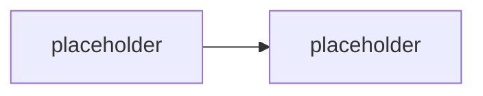

# Konvence

Závazná pravidla pro psaní materiálů GOC224. Cíl: konzistence napříč moduly a snadná údržba (malé soubory = malé diffy).

## Jazyk

- **Obsah**: čeština.
- **Cesty a názvy souborů/složek**: angličtina, `kebab-case`.

## Struktura modulu

Jeden modul = jedna složka. Slug složky, ne pořadové číslo. Volitelné moduly mají prefix `opt-`.

Typické soubory ve složce modulu:

| Soubor | Účel | Publikum |
|---|---|---|
| `README.md` | teorie / výklad modulu | student |
| `lab-*.md` | zadání labu | student |
| `instructor-notes.md` | timing, tripwires, otázky, fallbacky | jen lektor |

Pořadí modulů v běhu drží **`agenda.md`** — je to jediný zdroj pravdy o pořadí. Změna pořadí = úprava `agenda.md`, ne přejmenování složek.

## Markdown styl

- Nadpisy `##` / `###`, žádné přeskoky úrovní.
- Krátké odstavce, odrážky pro výčty.
- Odkazy na názvosloví vždy proti [`GLOSSARY.md`](GLOSSARY.md) — nepsat produktové názvy „od oka".

## Mermaid

- Diagramy jako fenced bloky ` ```mermaid ` přímo v `.md`. GitHub je renderuje nativně, žádný build step.
- **Výchozí motiv** (bez `%%{init}%%`) — nulová údržba, konzistentní vzhled.
- Placeholder v kostře:



## Currency-markery

Fast-moving fakta se v tomto oboru mění po měsících. Balit je do GitHub alertů, ať jsou vizuálně oddělené a grep-nutelné před každým během:

```md
> [!WARNING] Ověřit k datu běhu — stav k <RRRR-MM>.
> Cena / preview / PAYG rate / feature split.
```

Lineage a přejmenování:

```md
> [!IMPORTANT] Názvosloví
> <starý název> → <aktuální název>. V UI / dokumentaci se může objevit staré jméno.
```

## Delta sekce

Každý modul má na konci:

```md
## Stav produktu / delta
- <co se od napsání změnilo, co ověřit>
```
