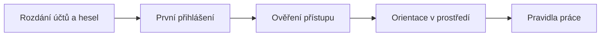

# M00 · Onboarding & pravidla práce

> Typ: povinný · Den: 1 (celé dopoledne) · Odhad: AM blok
> Prostředí: viz [`../../environment.md`](../../environment.md)

## Cíle
- Student je přihlášen do tenantu `spdemo.online` a ověří přístup ke svému pracovnímu prostoru.
- Student rozumí pravidlům způsobu práce a governance ground-rules, na které kurz dál navazuje.
- Student ví, že AI běží v PAYG režimu a co to znamená pro chování v učebně.

## Průběh dopoledne

1. **Rozdání účtů a hesel** — každý student dostane `user.NN@spdemo.online` (NN = 11–30) a heslo.
2. **První přihlášení** — portal.office.com, případný reset hesla / MFA dle nastavení tenantu.
3. **Ověření přístupu** — student vidí svůj web/knihovnu a Copilot in SharePoint (viz lab).
4. **Orientace v prostředí** — kde je SharePoint, kde Copilot, co znamená „Business Basic" (web, ne desktop).
5. **Pravidla způsobu práce** — viz [`ways-of-working.md`](ways-of-working.md).

## Poznámka k názvosloví
Katalog kurzu říká „SharePoint Premium". Značka byla rozdělena — v kurzu používáme aktuální názvy (viz [`../../GLOSSARY.md`](../../GLOSSARY.md)). Tuto poznámku studentům řekni hned tady, ať je katalog vs. slajdy nemate.

## Klíčové rozlišení
- **Onboarding vs. konfigurace**: tady jen přístup a identity. Zapínání funkcí (`KnowledgeAgentScope`, search/zdroje) je až v konfiguraci (den 2) — a je to instruktorské demo (studenti nejsou admini).
- **Licence vs. permissions**: licence (Business Basic + PAYG) řeší *přístup k funkci*; SharePoint role (Owner/Edit/View) řeší *kdo co na webu dělá*.

## Lab
Viz [`lab-tenant-access.md`](lab-tenant-access.md).

## Stav produktu / delta
> [!WARNING] Ověřit k datu běhu — přihlašovací UI M365, stav PAYG billing policy v tenantu, dostupnost Copilot in SharePoint (preview).
