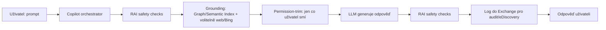

# M · AI landscape a pozicování Copilotu

> Typ: povinný · Den: 1 · Odhad: PM blok
> Názvosloví: [`../../GLOSSARY.md`](../../GLOSSARY.md) · Zdroje ozdrojované odkazy na Microsoft (viz [Zdroje](#zdroje-microsoft)).

## Cíle

- Student umí zasadit Microsoft Copilot mezi ostatní AI nástroje.
- Student vysvětlí rozdíl web-grounded vs. tenant-grounded a co znamenají datové hranice.
- Student zná 6 principů zodpovědné AI Microsoftu.
- Student ví, kam v rodině Copilotů zapadá Copilot in SharePoint a Document processing.

## 1. Stručně: AI, LLM, generativní AI

Krátký koncepční úvod (bez produktových detailů):
- **AI → strojové učení → generativní AI**: modely, které generují text/obraz na základě vzorů z tréninkových dat.
- **LLM (large language model)**: predikuje pravděpodobný následující token; „nezná pravdu", jen vzory → nutná lidská kontrola a grounding.
- **Grounding / RAG**: doplnění promptu o relevantní data (web nebo tenant), aby odpověď byla konkrétní a aktuální. Tohle je klíč k pochopení rozdílu mezi nástroji dál.

Microsoft učební zdroje: [AI learning hub](https://learn.microsoft.com/en-us/training/), [Responsible AI training](https://learn.microsoft.com/en-us/training/modules/embrace-responsible-ai-principles-practices/).

## 2. Zásady zodpovědné AI (Microsoft)

Microsoft staví na **Responsible AI Standard** a šesti principech: **fairness, reliability & safety, privacy & security, inclusiveness, transparency, accountability** ([Principles & approach](https://www.microsoft.com/en-us/ai/principles-and-approach), [What is Responsible AI](https://learn.microsoft.com/en-us/azure/machine-learning/concept-responsible-ai), [Service assurance](https://learn.microsoft.com/en-us/compliance/assurance/assurance-artificial-intelligence)). Standard je rozdělený do 6 domén a 14 cílů s konkrétními požadavky; RAI safety checks běží i za běhu Copilota (viz data flow níže).

## 3. ChatGPT-styl vs. Microsoft Copilot — grounding a datové hranice

Nosné rozlišení celého kurzu.

| | Veřejný chat (ChatGPT-styl) / Copilot Chat (Basic) | Microsoft 365 Copilot (add-on) |
|---|---|---|
| Grounding | web (u Copilot Chat přes Bing) | **tenant** přes Microsoft Graph + Semantic Index (+ volitelně web) |
| Přístup k org obsahu | ne (jen co vložíš do promptu) | ano, ale **jen co uživatel smí vidět** |
| Datová hranice | — | Microsoft 365 service boundary, EDP |
| Trénink na tvých datech | u veřejných nástrojů záleží na podmínkách | **ne** — prompty/odpovědi netrénují foundation modely |

Klíčová fakta (Microsoft):

- Copilot i Copilot Chat běží v **Microsoft 365 service boundary** s **enterprise data protection (EDP)**; prompty a odpovědi **netrénují** foundation modely ([Enterprise data protection](https://learn.microsoft.com/en-us/microsoft-365/copilot/enterprise-data-protection), [Privacy & protections](https://learn.microsoft.com/en-us/copilot/privacy-and-protections)).
- **Permission-trimming**: Copilot zobrazí jen data, na která má uživatel oprávnění; Graph/Semantic Index ctí identity-based access boundary; ctí i Purview sensitivity labels a šifrování ([Data, privacy & security](https://learn.microsoft.com/en-us/microsoft-365/copilot/microsoft-365-copilot-privacy), [Data protection architecture](https://learn.microsoft.com/en-us/microsoft-365/copilot/microsoft-365-copilot-architecture-data-protection-auditing)).
- **Copilot Chat (Basic)** je grounded jen na webu (Bing), ne na org obsahu, dokud ho uživatel nevloží ([Copilot overview](https://learn.microsoft.com/en-us/copilot/overview)).

> [!IMPORTANT] EU datové hranice — přímo pro CZ/EU zákazníky
> Microsoft se hlásí ke GDPR, **EU Data Boundary** a ISO/IEC 27018. Ale: **web search dotazy** (přes Bing) a **modely Anthropic** jsou z EU Data Boundary aktuálně **vyňaty** ([Enterprise data protection](https://learn.microsoft.com/en-us/microsoft-365/copilot/enterprise-data-protection)). To je ta governance nit z `../onboarding/ways-of-working.md` — konkrétní, doložitelný bod pro EU tenanty.

## 4. Rodina Copilotů a kam zapadá SharePoint

Microsoft nabízí Copilot napříč produkty (Word/Excel/PowerPoint/Outlook/Teams, Copilot Chat, agenti) ([Copilot overview](https://learn.microsoft.com/en-us/copilot/overview)).

- **Copilot in SharePoint** = Copilot zážitek nad weby a knihovnami (vč. Skills a agentů) — surface, kde probíhá většina kurzu.
- **Document processing for Microsoft 365** není „Copilot", ale **dodává Copilotu strukturovaná metadata** (vytěžování dokumentů) → lepší grounding. Vztah: Document processing vytěžuje → Copilot se ptá nad vytěženým (viz `../licensing/`).

## Data flow (jak Copilot zpracuje dotaz)

## Klíčové rozlišení

- **Web-grounded vs. tenant-grounded** — hlavní osa; určuje, co Copilot „ví".
- **Copilot ≠ Document processing** — Copilot se ptá, Document processing připravuje data.
- **EDP ≠ EU Data Boundary pro všechno** — web queries a Anthropic modely jsou vyňaty.

## 5. Naše prostředí (kurz)

Studenti mají **Copilot přes PAYG** (ne plný add-on) → v Copilot Chatu jsou na webovém groundingu, tenant grounding a agenty odemyká PAYG (viz `../licensing/`). Pro EU governance demo je vyňetí Anthropic modelů z EU Data Boundary konkrétní bod k ukázání.

## Lab

Viz [`lab-readiness-checklist.md`](lab-readiness-checklist.md).

## Zdroje (Microsoft)

Responsible AI: [Principles & approach](https://www.microsoft.com/en-us/ai/principles-and-approach) · [What is Responsible AI](https://learn.microsoft.com/en-us/azure/machine-learning/concept-responsible-ai) · [Service assurance](https://learn.microsoft.com/en-us/compliance/assurance/assurance-artificial-intelligence) · [Training](https://learn.microsoft.com/en-us/training/modules/embrace-responsible-ai-principles-practices/)
Grounding & data protection: [Enterprise data protection](https://learn.microsoft.com/en-us/microsoft-365/copilot/enterprise-data-protection) · [Privacy & protections](https://learn.microsoft.com/en-us/copilot/privacy-and-protections) · [Data, privacy & security](https://learn.microsoft.com/en-us/microsoft-365/copilot/microsoft-365-copilot-privacy) · [Architecture](https://learn.microsoft.com/en-us/microsoft-365/copilot/microsoft-365-copilot-architecture) · [Data protection architecture](https://learn.microsoft.com/en-us/microsoft-365/copilot/microsoft-365-copilot-architecture-data-protection-auditing) · [Web search data](https://learn.microsoft.com/en-us/microsoft-365/copilot/manage-public-web-access)
Copilot family: [Copilot overview](https://learn.microsoft.com/en-us/copilot/overview)

## Stav produktu / delta

> [!WARNING] Ověřit k datu běhu
> - Vyňetí Anthropic modelů z EU Data Boundary se může měnit — ověřit v Enterprise data protection dokumentu.
> - Modely za Copilotem se mění (GPT-5.x, Anthropic); model updates nemění bezpečnostní/compliance nastavení.
> - Copilot in SharePoint je v preview.
