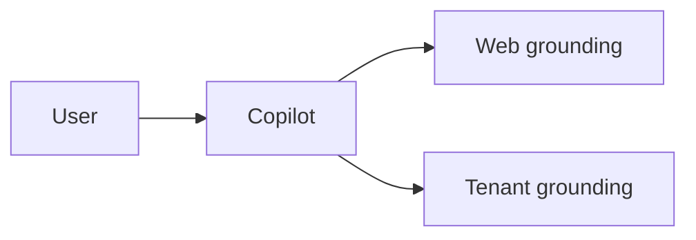

# M · AI landscape a pozicování Copilotu

> Typ: povinný · Den: 1 · Odhad: PM blok

## Cíle
- Student umí zasadit Copilot mezi ostatní AI a chápe grounding a datové hranice.

## Výklad
- Stručná historie AI, LLM, zásady zodpovědné AI.
- ChatGPT vs. Microsoft Copilot: záběr, grounding, datové hranice.
- Copiloti napříč M365 a kde zapadá Copilot in SharePoint / Document processing.

## Klíčové rozlišení
- Web-grounded Chat vs. tenant-grounded Copilot (návaznost na licencování).

## Lab
Viz [`lab-readiness-checklist.md`](lab-readiness-checklist.md).

## Stav produktu / delta
> [!WARNING] Ověřit k datu běhu — model za Copilot in SharePoint, subprocessor stav (EU default-off).
