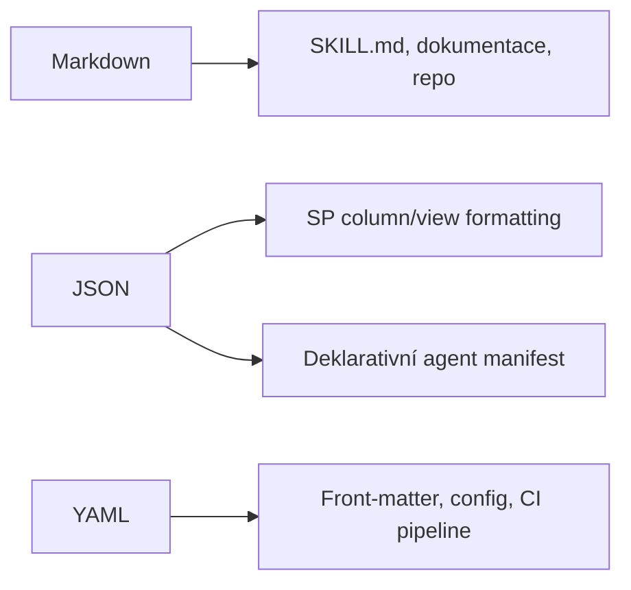

# M · Formáty: JSON, MD, YAML

> Typ: povinný · Den: 1 (konec AM) · Odhad: krátký blok
> Ozdrojováno odkazy na Microsoft (viz [Zdroje](#zdroje-microsoft)).

## Cíle

- Student rozliší tři formáty a ví, **kde přesně** je v kurzu potká.
- Student přečte a upraví jednoduchý JSON / MD / YAML bez tápání.

## Proč hned na začátku

Tyhle tři formáty potkáš dřív než cokoli jiného: repo je v **MD**, Skills jsou **MD**, SharePoint column/view formatting je **JSON**, konfigurace a front-matter jsou **YAML**. Bez nich se pak studenti u pozdějších labů zdrží.



## 1. Markdown (MD)

Lehké značkování pro text: nadpisy `#`, odrážky `-`, odkazy `[text](url)`, kód v \`backticks\`.
- **Kde v kurzu**: materiály kurzu (toto repo), **Skills** se ukládají jako `SKILL.md` do knihovny Agent Assets ([Skills in Copilot in SharePoint](https://learn.microsoft.com/en-us/sharepoint/copilot-in-sharepoint-skills)), instrukce agentů.

## 2. JSON

Strukturovaná data: objekty `{}`, pole `[]`, dvojice `"klíč": hodnota`. Bez komentářů, striktní syntaxe (čárky, uvozovky).
- **Kde v kurzu**: **SharePoint column a view formatting** ([Column formatting](https://learn.microsoft.com/en-us/sharepoint/dev/declarative-customization/column-formatting), [View formatting](https://learn.microsoft.com/en-us/sharepoint/dev/declarative-customization/view-formatting)), **manifest deklarativního agenta** (`declarativeAgent.json`) ([Build declarative agents](https://learn.microsoft.com/en-us/microsoft-365/copilot/extensibility/build-declarative-agents)), API payloady.

Mini příklad (obarvení sloupce dle hodnoty):

```json
{
  "$schema": "https://developer.microsoft.com/json-schemas/sp/v2/column-formatting.schema.json",
  "elmType": "div",
  "txtContent": "@currentField",
  "style": { "color": "=if(@currentField == 'Done', 'green', 'red')" }
}
```

## 3. YAML

Čitelná konfigurace, odsazením místo závorek; povoluje komentáře `#`. Pozor na odsazení (mezery, ne taby).
- **Kde v kurzu**: **front-matter** dokumentů, konfigurační soubory, **CI pipeline** (GitHub Actions) v repu; projektový config nástroje Microsoft 365 Agents Toolkit je také YAML.

Mini příklad (front-matter):

```yaml
title: Modul licencí
type: povinný
den: 1
```

## Klíčové rozlišení

- **JSON vs. YAML**: stejná data, jiný zápis. JSON = striktní, bez komentářů (API, SP formatting); YAML = čitelný, s komentáři (config, front-matter).
- **MD** není data, ale text — pro obsah, ne pro konfiguraci.
- Odsazení v YAML je významové; v JSON ne (tam rozhodují závorky a čárky).

## Zdroje (Microsoft)

[Skills v Copilot in SharePoint (MD)](https://learn.microsoft.com/en-us/sharepoint/copilot-in-sharepoint-skills) · [Column formatting (JSON)](https://learn.microsoft.com/en-us/sharepoint/dev/declarative-customization/column-formatting) · [View formatting (JSON)](https://learn.microsoft.com/en-us/sharepoint/dev/declarative-customization/view-formatting) · [Formatting syntax reference](https://learn.microsoft.com/en-us/sharepoint/dev/declarative-customization/formatting-syntax-reference) · [Deklarativní agent manifest (JSON)](https://learn.microsoft.com/en-us/microsoft-365/copilot/extensibility/build-declarative-agents)

## Stav produktu / delta

- Stabilní téma bez fast-moving faktů. Ověřit jen aktuální název YAML config souboru Agents Toolkitu, pokud ho budeš v M09 ukazovat.
