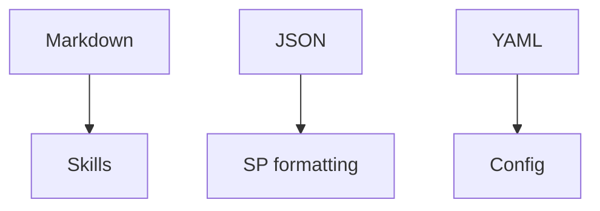

# M · Formáty: JSON, MD, YAML

> Typ: povinný · Den: 1 (konec AM) · Odhad: krátký blok

## Cíle
- Student rozliší tři formáty a ví, kde je v kurzu potká.

## Výklad
Krátká literacy trojice — proč je potřebuje dřív než cokoli dalšího. Role formátů viz [`../../GLOSSARY.md`](../../GLOSSARY.md).

- **Markdown** — materiály, Skills (`SKILL.md`), dokumentace.
- **JSON** — SharePoint column/view formatting, konfigurace, API payloady.
- **YAML** — front-matter, konfigurační soubory, pipeline.

## Klíčové rozlišení
- JSON vs. YAML: kdy který a proč (čitelnost, komentáře, syntaxe).

## Stav produktu / delta
- Stabilní téma, bez fast-moving faktů.
