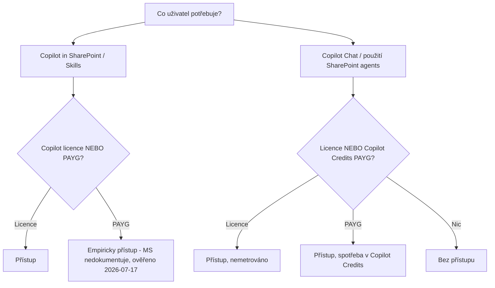

# Licenční modely a řízení nákladů

> Typ: povinný · Den: 1 · Odhad: PM blok
> Prostředí: [`../../environment.md`](../../environment.md) · Názvosloví: [`../../GLOSSARY.md`](../../GLOSSARY.md)
> Všechna tvrzení jsou ozdrojovaná odkazy na Microsoft (viz [Zdroje](#zdroje-microsoft)).

## Cíle
- Student rozliší licenční vrstvy Copilota (Chat/Basic vs. add-on/Premium; Business vs Enterprise; E7).
- Student odliší **dva PAYG modely** a ví, který co platí.
- Student aplikuje princip **licence vs. permissions**.
- Student zasadí kurzovní prostředí (Business Basic + PAYG) do licenčního obrazu.

## 1. Licenční vrstvy Copilota

**Copilot Chat (Basic) je součást předplatného zdarma**, add-on **Microsoft 365 Copilot (Premium)** se dokupuje. Chat je web-grounded; add-on odemyká vnořený Copilot ve Word/Excel/Outlook/Teams a work-grounded chat ([License options](https://learn.microsoft.com/en-us/microsoft-365/copilot/microsoft-365-copilot-licensing), [Extensibility cost considerations](https://learn.microsoft.com/en-us/microsoft-365/copilot/extensibility/cost-considerations), [Copilot Chat requirements](https://learn.microsoft.com/en-us/microsoft-365/copilot/microsoft-365-copilot-chat-requirements)).

Add-on kvalifikuje na base plánech **Business Basic / Standard / Premium**, **A3/A5**, **E3/E5**; **E7 (Frontier Suite)** Copilot už obsahuje ([Minimum requirements](https://learn.microsoft.com/en-us/microsoft-365/copilot/microsoft-365-copilot-minimum-requirements), [Setup](https://learn.microsoft.com/en-us/microsoft-365/copilot/microsoft-365-copilot-setup)).

Prerekvizity: Microsoft Entra ID účet, schránka na Exchange Online, pro některé funkce OneDrive, podporovaný update channel ([Requirements](https://learn.microsoft.com/en-us/microsoft-365/copilot/microsoft-365-copilot-requirements)).

In-app funkce Copilota jsou mezi Business a Enterprise stejné; rozdíl je v tom, co je „pod tím" (bezpečnost, compliance, Purview) — přehled funkcí napříč plány je ve [service description](https://learn.microsoft.com/en-us/office365/servicedescriptions/office-365-platform-service-description/microsoft-365-copilot).

> [!IMPORTANT] Least privilege
> Copilot a AI experiences lze spravovat rolí **AI Administrator** bez Global Adminu ([Copilot Chat requirements](https://learn.microsoft.com/en-us/microsoft-365/copilot/microsoft-365-copilot-chat-requirements)).

## 2. Dva PAYG modely (nezaměňovat)

| Model | Co platí | Jak se měří | Setup |
|---|---|---|---|
| **Document processing for Microsoft 365** (ex-Syntex) | vytěžování dokumentů, OCR, překlad, autofill, eSignature | Azure metry (za stránku/transakci) | M365 admin center + Azure subscription |
| **Copilot Credits** | agenti / Copilot in SharePoint / Copilot Chat nad tenant daty | Copilot Credits (jednotka spotřeby) | PAYG billing policy + Azure |

**Document processing PAYG**: org-wide přístup pro kohokoli s M365 licencí, bez upfront nákupu, Azure billing; k nastavení je potřeba **SharePoint Administrator nebo Global Administrator** ([Licensing](https://learn.microsoft.com/en-us/microsoft-365/documentprocessing/syntex-licensing), [Set up billing](https://learn.microsoft.com/en-us/microsoft-365/contentunderstanding/syntex-azure-billing), [PAYG pricing](https://learn.microsoft.com/en-us/microsoft-365/documentprocessing/syntex-pay-as-you-go-services)).

> [!WARNING] Ověřit k datu běhu
> Bezplatná included kapacita pro document processing platila jen **do prosince 2025** a **nikdy** nezahrnovala Archive ani Backup ([PAYG pricing](https://learn.microsoft.com/en-us/microsoft-365/documentprocessing/syntex-pay-as-you-go-services)). Je červenec 2026 → v labech nespoléhat na „zkoušet zdarma".

**Copilot Credits**: od 1. 9. 2025 je společná měna agentů „Copilot Credits" (dříve messages). Uživatel s **M365 Copilot licencí** má agenty v Copilot Chatu/Teams/SharePointu pro tenant grounding **bez metrování**; **nelicencovaný** uživatel je může používat jen přes zapnutý PAYG a spotřeba se měří ([Copilot Studio licensing](https://learn.microsoft.com/en-us/microsoft-copilot-studio/billing-licensing), [Agents for Copilot Chat](https://learn.microsoft.com/en-us/copilot/agents), [Usage-based billing](https://learn.microsoft.com/en-us/microsoft-365/copilot/usage-based-billing-overview-copilot-credits)). Orientačně **~12 kreditů** na složitý tenant-grounded dotaz (10 za grounding + 2 za generativní odpověď); při **~$0,01/kredit** to je ~$0,12 za interakci ([Billing rates](https://learn.microsoft.com/en-us/microsoft-copilot-studio/requirements-messages-management), [Credits report](https://learn.microsoft.com/en-us/microsoft-365/admin/activity-reports/microsoft-365-copilot-credits), [SharePoint Embedded meters](https://learn.microsoft.com/en-us/sharepoint/dev/embedded/administration/billing/meters), [Capacity packs](https://learn.microsoft.com/en-us/microsoft-365/copilot/pay-as-you-go/copilot-capacity-packs)).

> [!WARNING] Rozpočet ≠ strop
> U PAYG pro Copilot Chat / SharePoint agenty budget jen **posílá e-mailová upozornění, spotřebu nezastaví** — služba běží dál i po překročení ([PAYG setup](https://learn.microsoft.com/en-us/microsoft-365/copilot/pay-as-you-go/setup)). Přehled všech PAYG služeb: [Pay-as-you-go services](https://learn.microsoft.com/en-us/microsoft-365/commerce/services/pay-as-you-go-services).

## 3. Governance produkty a jejich licenční dotyk

Bývalý deštník „SharePoint Premium" je rozdělen — tohle jsou **samostatné produkty** (viz `../../GLOSSARY.md`):

- **SharePoint Advanced Management (SAM)** — add-on **$3/uživatel/měsíc** (SAM Plan 1); NEBO se SAM funkce zpřístupní SharePoint adminům, když má aspoň jeden uživatel M365 Copilot licenci; E7 SAM obsahuje. Některé funkce (restricted site creation by apps) vyžadují SAM Plan 1 i tak. Role: SharePoint Admin / SAM Admin; správa přes SPO Management Shell ([Overview](https://learn.microsoft.com/en-us/sharepoint/advanced-management), [Prerequisites](https://learn.microsoft.com/en-us/sharepoint/sharepoint-advanced-management-prerequisites), [Features in Copilot licenses](https://learn.microsoft.com/en-us/sharepoint/sharepoint-advanced-management-licensing)).
- **eSignature** — PAYG služba pod document processing; poskytovatelé Adobe Acrobat Sign a Docusign; simple e-signatures dle eIDAS (EU 910/2014); celosvětově kromě Indonésie; PDF i Word; k nastavení SharePoint/Global Admin ([Overview](https://learn.microsoft.com/en-us/microsoft-365/documentprocessing/esignature-overview), [Setup](https://learn.microsoft.com/en-us/microsoft-365/documentprocessing/esignature-setup)).
- **Microsoft 365 Backup** — samostatný produkt; SharePoint + OneDrive + Exchange; PAYG dle objemu dat; data zůstávají v Microsoft trust boundary, zálohy immutable/append-only ([Overview](https://learn.microsoft.com/en-us/microsoft-365/backup/backup-overview), [Docs](https://learn.microsoft.com/en-us/microsoft-365/backup/)).
- **Microsoft 365 Archive** — samostatný produkt; cold storage tier v SharePointu; platíš při překročení kvóty; archivovaný obsah Copilot nepoužívá (lepší relevance); role SharePoint/Global Admin ([Overview](https://learn.microsoft.com/en-us/microsoft-365/archive/archive-overview), [Manage](https://learn.microsoft.com/en-us/microsoft-365/archive/archive-manage)).

## 4. Licence vs. permissions

- **Licence** = přístup k *funkci*. Microsoft dokumentuje **Copilot in SharePoint a Skills jako license-only** ([get-started](https://learn.microsoft.com/en-us/sharepoint/copilot-in-sharepoint-get-started) uvádí jen Copilot licenci), ale **empiricky fungují i na PAYG bez licence** — tvorba i použití; totéž **tvorba a nasazení agentů přes Agents Toolkit** (ověřeno na kurzu **2026-07-17**, MS to takto nedokumentuje — docs lag). Copilot Chat a použití SharePoint agents = licence NEBO Copilot Credits PAYG. **Výjimka: tvorba SharePoint agenta Copilot licenci vyžaduje** (empiricky potvrzeno — použití jde přes PAYG).
- **SharePoint permissions** = *kdo funkci použije* (Edit = tvorba agenta/Skillu, View = spuštění). Agenti v SharePointu jsou `.agent` soubory; oprávnění na souboru řídí přístup ([Manage access to agents in SharePoint](https://learn.microsoft.com/en-us/sharepoint/manage-access-agents-in-sharepoint)).

## Diagram — licenční decision flow

## 5. Naše prostředí (kurz)
Studenti mají **Business Basic + Copilot PAYG** → cesta „nelicencovaný + PAYG". Funguje **Copilot Chat, použití SharePoint agents**, a **empiricky i Copilot in SharePoint / Skills (tvorba i použití)** a **tvorba/nasazení agentů přes Agents Toolkit**. Microsoft to takto nedokumentuje (docs uvádějí Copilot licenci), ale **ověřeno na kurzu 2026-07-17**, platí k dnešnímu datu (re-verify při GA). Každá interakce čerpá kredity bez tvrdého stropu (proto budget alert + páteční deaktivace účtů, viz `../../environment.md`). **Výjimka: tvorbu SharePoint agenta** studenti bez Copilot licence **nezvládnou** (jen instruktor); použití agenta jde přes PAYG.

## 6. Doplňky, které souvisí s kurzem

### Agent 365 — řídicí vrstva agentů (ne nástroj na stavbu)
Governance/security control plane pro AI agenty napříč tenantem: registry, agent identity, access control, napojení na Entra/Defender/Purview/Intune. GA 1. 5. 2026, **per-user**, **$15/uživatel/měs** samostatně nebo součást **E7 ($99)**; agenti sami se nelicencují, licencuje se uživatel, který s nimi pracuje/spravuje/sponzoruje. Microsoft to staví jako: *Copilot = co AI umí; Agent 365 = co AI smí* ([Overview](https://learn.microsoft.com/en-us/microsoft-agent-365/overview), [Licensing FAQ](https://www.microsoft.com/licensing/faqs/122), [GA blog](https://www.microsoft.com/en-us/security/blog/2026/05/01/microsoft-agent-365-now-generally-available-expands-capabilities-and-integrations/)). Hloubkově → [`../../day-5/copilot-admin/`](../../day-5/copilot-admin/).

### SharePoint Storage PAYG (třetí typ PAYG)
**Microsoft 365 SharePoint Storage** = PAYG úložiště nad rámec kvóty tenantu (public preview od června 2026, komerční tenanty, ne EDU/GCC). Kvóta 1 TB + 10 GB / SharePoint licence; při překročení se blokuje klasické zakládání webů a přes PowerShell. Setup: SharePoint/Global Admin ([Add storage](https://learn.microsoft.com/en-us/microsoft-365/commerce/add-storage-space), [Plan storage](https://learn.microsoft.com/en-us/sharepoint/sharepoint-storage-planning)). Souvisí s [`../../day-4/archive/`](../../day-4/archive/) (levnější tier vs. dokup kvóty).

### Azure Subscription — společný jmenovatel PAYG
Všechny PAYG modely (document processing, Copilot Credits, eSignature, Backup, Archive, storage) se účtují přes **připojenou Azure subscription + resource group**; k nastavení SharePoint/Global Admin ([Set up billing](https://learn.microsoft.com/en-us/microsoft-365/contentunderstanding/syntex-azure-billing)). Pro kurz: jedna Azure subscription tenantu je prerekvizita pro všechny PAYG demo scénáře.

### Vývojářské nástroje (patří do [`day-3/procode-vs-lowcode`](../../day-3/procode-vs-lowcode/))
Pro-code cesta ke stavbě agentů: **VS Code + Microsoft 365 Agents Toolkit** (nástupce Teams Toolkitu; i pro Visual Studio, GitHub Copilot a CLI) scaffolduje deklarativní agenty, edituje manifest, provisionuje, umí akce přes MCP; **GitHub Copilot** jako AI asistent při psaní kódu ([Agents Toolkit intro](https://devblogs.microsoft.com/microsoft365dev/introducing-the-microsoft-365-agents-toolkit/), [Build declarative agents](https://learn.microsoft.com/en-us/microsoft-365/copilot/extensibility/build-declarative-agents), [MCP agents](https://devblogs.microsoft.com/microsoft365dev/build-declarative-agents-for-microsoft-365-copilot-with-mcp/)). Licenční dotyk: Agents Toolkit je zdarma, GitHub Copilot má vlastní licenci. Detail → [`../../day-3/procode-vs-lowcode/`](../../day-3/procode-vs-lowcode/).

- **„Skills jen pro E licence"** — mýtus. MS dokumentuje gate jako *placenou* M365 Copilot licenci (bez ohledu na tier, i Business), **ale empiricky Skills jedou i na PAYG bez licence** (ověřeno na kurzu 2026-07-17; MS to nedokumentuje — re-verify při GA).
- **Dva PAYG** — Document processing (Azure metry) ≠ Copilot Credits.
- **Budget ≠ strop** u Copilot PAYG.
- **„SharePoint Premium"** jako jeden produkt — neexistuje, je rozdělený.

## Zdroje (Microsoft)
Copilot licence: [License options](https://learn.microsoft.com/en-us/microsoft-365/copilot/microsoft-365-copilot-licensing) · [Minimum requirements](https://learn.microsoft.com/en-us/microsoft-365/copilot/microsoft-365-copilot-minimum-requirements) · [Requirements](https://learn.microsoft.com/en-us/microsoft-365/copilot/microsoft-365-copilot-requirements) · [Setup](https://learn.microsoft.com/en-us/microsoft-365/copilot/microsoft-365-copilot-setup) · [Chat requirements](https://learn.microsoft.com/en-us/microsoft-365/copilot/microsoft-365-copilot-chat-requirements) · [Service description](https://learn.microsoft.com/en-us/office365/servicedescriptions/office-365-platform-service-description/microsoft-365-copilot) · [Extensibility cost](https://learn.microsoft.com/en-us/microsoft-365/copilot/extensibility/cost-considerations)
Document processing PAYG: [Overview](https://learn.microsoft.com/en-us/microsoft-365/documentprocessing/syntex-overview) · [Licensing](https://learn.microsoft.com/en-us/microsoft-365/documentprocessing/syntex-licensing) · [PAYG pricing](https://learn.microsoft.com/en-us/microsoft-365/documentprocessing/syntex-pay-as-you-go-services) · [Set up billing](https://learn.microsoft.com/en-us/microsoft-365/contentunderstanding/syntex-azure-billing)
Copilot Credits PAYG: [Overview](https://learn.microsoft.com/en-us/microsoft-365/copilot/pay-as-you-go/overview) · [Setup](https://learn.microsoft.com/en-us/microsoft-365/copilot/pay-as-you-go/setup) · [Usage-based billing](https://learn.microsoft.com/en-us/microsoft-365/copilot/usage-based-billing-overview-copilot-credits) · [Billing rates](https://learn.microsoft.com/en-us/microsoft-copilot-studio/requirements-messages-management) · [Copilot Studio licensing](https://learn.microsoft.com/en-us/microsoft-copilot-studio/billing-licensing) · [Credits report](https://learn.microsoft.com/en-us/microsoft-365/admin/activity-reports/microsoft-365-copilot-credits)
SAM: [Overview](https://learn.microsoft.com/en-us/sharepoint/advanced-management) · [Prerequisites](https://learn.microsoft.com/en-us/sharepoint/sharepoint-advanced-management-prerequisites) · [Features in Copilot licenses](https://learn.microsoft.com/en-us/sharepoint/sharepoint-advanced-management-licensing) · [Agents access](https://learn.microsoft.com/en-us/sharepoint/manage-access-agents-in-sharepoint)
eSignature: [Overview](https://learn.microsoft.com/en-us/microsoft-365/documentprocessing/esignature-overview) · [Setup](https://learn.microsoft.com/en-us/microsoft-365/documentprocessing/esignature-setup)
Backup: [Overview](https://learn.microsoft.com/en-us/microsoft-365/backup/backup-overview)
Archive: [Overview](https://learn.microsoft.com/en-us/microsoft-365/archive/archive-overview) · [Manage](https://learn.microsoft.com/en-us/microsoft-365/archive/archive-manage)
Agent 365: [Overview](https://learn.microsoft.com/en-us/microsoft-agent-365/overview) · [Licensing FAQ](https://www.microsoft.com/licensing/faqs/122) · [GA blog](https://www.microsoft.com/en-us/security/blog/2026/05/01/microsoft-agent-365-now-generally-available-expands-capabilities-and-integrations/)
Úložiště PAYG: [Add storage](https://learn.microsoft.com/en-us/microsoft-365/commerce/add-storage-space) · [Plan storage](https://learn.microsoft.com/en-us/sharepoint/sharepoint-storage-planning) · [Capacity packs](https://learn.microsoft.com/en-us/microsoft-365/copilot/pay-as-you-go/copilot-capacity-packs)
Vývojářské nástroje: [Agents Toolkit intro](https://devblogs.microsoft.com/microsoft365dev/introducing-the-microsoft-365-agents-toolkit/) · [Build declarative agents](https://learn.microsoft.com/en-us/microsoft-365/copilot/extensibility/build-declarative-agents) · [MCP agents](https://devblogs.microsoft.com/microsoft365dev/build-declarative-agents-for-microsoft-365-copilot-with-mcp/)

## Stav produktu / delta
> [!WARNING] Ověřit k datu běhu
> - Ceny (Copilot add-on, SAM $3, PAYG metry, $/kredit) — ověřit v aktuálních Microsoft cenících a v Copilot Credit Guide.
> - Basic vs Premium Copilot split (2026) — ověřit rozsah ve service description.
> - Copilot in SharePoint běží v preview; enablement přes `Set-SPOTenant -KnowledgeAgentScope`.
> - **Licenční delta (nejdůležitější):** MS dokumentuje Copilot in SharePoint / Skills jako license-only, ale **empiricky fungují i na PAYG bez Copilot licence** — tvorba i použití; totéž tvorba/nasazení přes Agents Toolkit. **Tvorba SharePoint agenta** Copilot licenci **vyžaduje**. Ověřeno na kurzu 2026-07-17 — při GA/dokumentaci znovu ověřit.
> - Hard-cap v novém Cost Management dashboardu zatím pokrývá jen vybrané služby (Cowork, Work IQ), ne SharePoint agenty.
