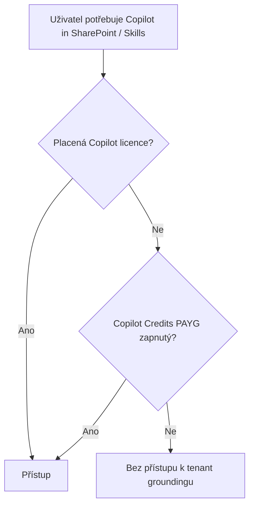

# M · Licenční modely a nákladové postoje

> Typ: povinný · Den: 1 · Odhad: PM blok

## Cíle
- Student rozliší licenční vrstvy, dva PAYG modely a princip licence vs. permissions.

## Výklad
- Copilot for M365 — přehled: E1 → E3 → E5 → **E7**, Business vs Enterprise, **Basic vs Premium split**.
- **Document processing for Microsoft 365 (PAYG)** a typické scénáře.
- Dva PAYG modely: Document processing (Azure metry) vs **Copilot Credits**.
- SAM (governance postoj); eSignature / Backup / Archive jako samostatné produkty.
- Princip **licence vs. permissions**.

Vše proti [`../../GLOSSARY.md`](../../GLOSSARY.md).

## Klíčové rozlišení
- Document processing PAYG vs. Copilot Credits PAYG (nezaměňovat).
- Licence (přístup k funkci) vs. permissions (kdo funkci použije).

## Lab
Viz [`lab-license-matrix.md`](lab-license-matrix.md).

## Stav produktu / delta
> [!WARNING] Ověřit k datu běhu — ceny E7 / Copilot Business promo / PAYG rates / Basic-Premium split.
