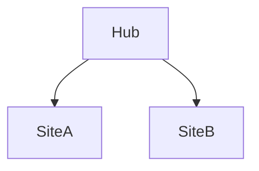

# M · Informační architektura SPO (volitelný)

> Typ: volitelný · Den: 1 (za SP úvodem) · Odhad: PM blok

## Cíle
- Student navrhne IA: hub weby, navigace, taxonomie, content types.

## Výklad
- Weby a hub weby, navigační vzory.
- Taxonomie / term store, metadata-driven organizace.
- Content types napříč weby.

## Stav produktu / delta
- Stabilní téma.

> [!NOTE] Volitelný — spouští se, když skupina IA refresher potřebuje. Žádný pozdější povinný modul na tomto nezávisí.
