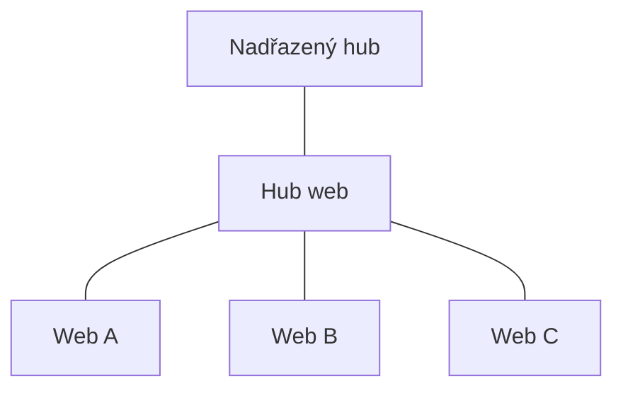

# Informační architektura SPO (volitelný)

> Typ: volitelný · Den: 1 (za SP úvodem) · Odhad: PM blok
> Ozdrojováno odkazy na Microsoft (viz [Zdroje](#zdroje-microsoft)).

> [!NOTE] Volitelný — spouští se, když skupina IA refresher potřebuje. Leaf modul: žádný pozdější povinný modul na něm nezávisí.

## Cíle

- Student navrhne IA napříč weby: hub struktura, navigace, taxonomie, content types.
- Student chápe IA jako průběžný proces, ne jednorázový návrh.

## 1. Šest vrstev moderní IA

Microsoft rozděluje IA do vrstev: globální navigace, hub struktura, lokální navigace webu/stránky, metadatová architektura, search zážitky, personalizace obsahu ([IA intro](https://learn.microsoft.com/en-us/sharepoint/information-architecture-modern-experience)).

## 2. Hub weby

- Moderní intranet: **plochá struktura site collections spojených huby**, ne subweby (subweby jsou rigidní a promítají se do URL) ([Planning hub sites](https://learn.microsoft.com/en-us/sharepoint/planning-hub-sites)).
- Web se přidá do hubu **asociací**; zdědí motiv a sdílenou navigaci, obsah se rolluje do hubu, web spadne do search scope hubu.
- Lze tvořit **hierarchii hubů** (hub-to-hub, roll-up až 3 úrovně).

## 3. Taxonomie a metadata

- **Managed metadata / term store**: řízená taxonomie termínů; globální term sety vs. lokální (per site collection) ([Managed metadata planning](https://learn.microsoft.com/en-us/sharepoint/governance/managed-metadata-planning)).
- **Content types** a content type hub pro sdílení napříč site collections ([Content type planning](https://learn.microsoft.com/en-us/sharepoint/governance/content-type-and-workflow-planning)).
- Metadata pohánějí navigaci, filtrování, search i retention/compliance.

## 4. Navigace a modely IA

Navigační design (globální / hub / lokální) + modely organizace (dle scénáře, úkolů, geografie) ([IA models & examples](https://learn.microsoft.com/en-us/sharepoint/information-architecture-models-examples)). Web může být asociován jen k **jednomu** hubu; další propojení přes navigační odkazy.

## 5. IA je průběžný proces

Optimální IA se vyvíjí — organizace, lidé i projekty se mění. Měřit, iterovat, udržovat relevanci ([IA intro](https://learn.microsoft.com/en-us/sharepoint/information-architecture-modern-experience)).

## Lab

Návrh IA pro modelovou organizaci (weby, hub, taxonomie) — TODO doplnit zadání.

## Zdroje (Microsoft)

[IA intro](https://learn.microsoft.com/en-us/sharepoint/information-architecture-modern-experience) · [IA models & examples](https://learn.microsoft.com/en-us/sharepoint/information-architecture-models-examples) · [Planning hub sites](https://learn.microsoft.com/en-us/sharepoint/planning-hub-sites) · [Managed metadata planning](https://learn.microsoft.com/en-us/sharepoint/governance/managed-metadata-planning) · [Content type planning](https://learn.microsoft.com/en-us/sharepoint/governance/content-type-and-workflow-planning)

## Stav produktu / delta

- Stabilní téma. Vazba na Copilot: dobrá IA + metadata zlepšují grounding a relevanci (viz `../ai-landscape/`).
