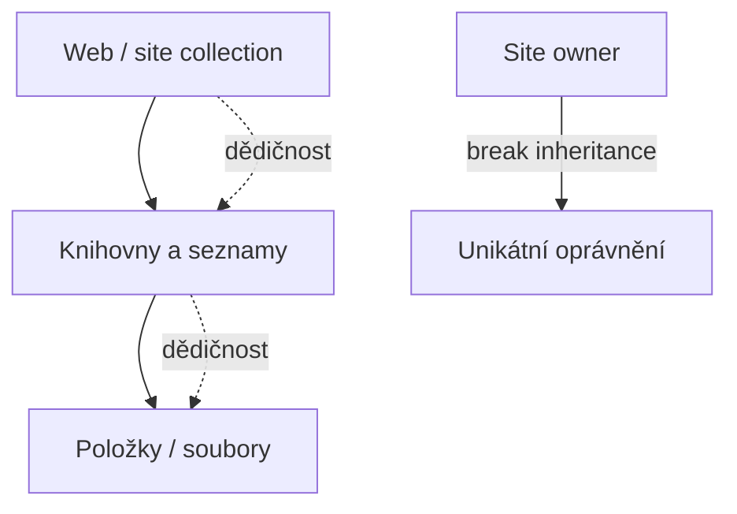

# SharePoint technologický úvod

> Typ: povinný · Den: 1 · Odhad: PM blok
> Názvosloví: [`../../GLOSSARY.md`](../../GLOSSARY.md) · Ozdrojováno odkazy na Microsoft (viz [Zdroje](#zdroje-microsoft)).

## Cíle

- Student rozumí základnímu modelu SPO: weby, knihovny, permissions, metadata, content types, search.
- Student ví, kde končí SP Online a začínají add-on schopnosti (Document processing, SAM, Backup/Archive, Copilot in SharePoint).
- Student chápe, proč je kvalita permissions a metadat základ pro Copilot grounding.

## 1. Stavební bloky SPO

- **Weby** (site) jako jednotka práce. Moderní přístup: každá jednotka práce = vlastní **site collection** (komunikační web nebo Microsoft 365 group-connected team web), ne subweby ([Planning hub sites](https://learn.microsoft.com/en-us/sharepoint/planning-hub-sites)).
- **Knihovny a seznamy**: knihovna = speciální typ seznamu pro soubory. Každý web má aspoň jednu knihovnu.
- **URL model SPO**: vše pod jedním hostname `https://<tenant>.sharepoint.com` (v našem prostředí `ms365x17157302`, viz `../../environment.md`).

## 2. Permissions model

- **Permission levels** (Full Control, Edit/Contribute, Read, …) přiřazované přes **SharePoint groups**; least privilege ([Understanding permission levels](https://learn.microsoft.com/en-us/sharepoint/understanding-permission-levels)).
- **Dědičnost**: seznamy/knihovny/položky dědí oprávnění z webu. Site owner může dědičnost přerušit (break inheritance) a nastavit unikátní oprávnění — používat co nejméně.
- Pro modernu: komunikační weby přes SharePoint groups, team weby přes napojenou Microsoft 365 skupinu.

## 3. Metadata, content types, search

- **Sloupce a content types** jsou dva nejdůležitější metadatové prvky pro organizaci obsahu; metadata pohánějí filtrování, řazení i **search** ([IA intro](https://learn.microsoft.com/en-us/sharepoint/information-architecture-modern-experience)).
- **Content type** = znovupoužitelná sada metadat (sloupců), chování a nastavení pro kategorii obsahu ([Content type planning](https://learn.microsoft.com/en-us/sharepoint/governance/content-type-and-workflow-planning)).
- **Managed metadata / term store** = řízená taxonomie termínů napříč tenantem ([Managed metadata](https://learn.microsoft.com/en-us/sharepoint/managed-metadata)).
- **Složky vs. metadata**: preferovat metadata; hluboké zanoření složek zhoršuje dohledatelnost.

## 4. Kde končí SPO a začínají add-ony

Toto je most do zbytku kurzu:

| Vrstva | Co to je |
|---|---|
| **SharePoint Online (jádro)** | weby, knihovny, permissions, metadata, search |
| **Document processing for Microsoft 365** | AI vytěžování obsahu (PAYG) |
| **SharePoint Advanced Management (SAM)** | governance webů/OneDrive |
| **Microsoft 365 Backup / Archive** | ochrana a cold storage dat |
| **Copilot in SharePoint** | AI nad weby (Skills, agenti) |

## Klíčové rozlišení

- **Knihovna je typ seznamu** (soubory = položky seznamu).
- **Metadata > složky** pro dohledatelnost a governance.
- **Kvalita permissions = základ Copilot groundingu**: co je přesdílené, to Copilot „vidí" (návaznost na `../ai-landscape/` a permission-trimming).

## 5. Vazba na kurz

Kvalita IA a permissions z tohoto modulu je předpoklad pro bezpečné nasazení Copilota (SAM v [`../../day-3/advanced-management/`](../../day-3/advanced-management/) to pak vynucuje, oversharing reporty atd.). Prohloubení IA je ve volitelném [`../opt-ia-spo/`](../opt-ia-spo/).

## Zdroje (Microsoft)

[Understanding permission levels](https://learn.microsoft.com/en-us/sharepoint/understanding-permission-levels) · [IA intro](https://learn.microsoft.com/en-us/sharepoint/information-architecture-modern-experience) · [Planning hub sites](https://learn.microsoft.com/en-us/sharepoint/planning-hub-sites) · [Managed metadata](https://learn.microsoft.com/en-us/sharepoint/managed-metadata) · [Content type planning](https://learn.microsoft.com/en-us/sharepoint/governance/content-type-and-workflow-planning)

## Stav produktu / delta

- Stabilní jádro. Ověřit jen názvy add-on vrstev proti `../../GLOSSARY.md`.
