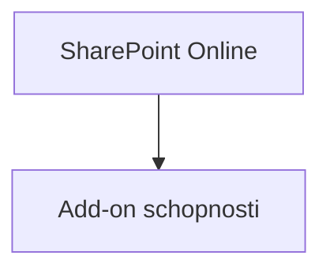

# M · SharePoint technologický úvod

> Typ: povinný · Den: 1 · Odhad: PM blok

## Cíle
- Student rozumí základnímu modelu SPO a ví, kde končí SP Online a začínají add-on schopnosti.

## Výklad
- Weby, knihovny, permissions model.
- Search, metadata, content types.
- Kde končí SP Online a začínají add-on schopnosti (Document processing, SAM, Backup/Archive, Copilot in SharePoint).

## Stav produktu / delta
- Ověřit názvy add-on vrstev proti `../../GLOSSARY.md`.
