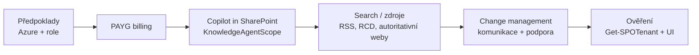

# M · Konfigurace krok za krokem

> Typ: povinný · Den: 2 · Odhad: PM blok
> Prostředí: viz [`../../environment.md`](../../environment.md) · Názvosloví: [`../../GLOSSARY.md`](../../GLOSSARY.md)

## Cíle

- Student zná pořadí kroků: předpoklady → PAYG billing → zapnutí Copilot in SharePoint → rozsah → ověření.
- Student umí přečíst a interpretovat `KnowledgeAgentScope` a související ovladače.
- Student odchází s konfiguračním runbookem (dry-run z labu) včetně change-management kroků.

## Výklad

### Krok 0 — předpoklady

Azure subscription ve stejném tenantu + resource group; role SharePoint/Global Admin v M365 + Owner/Contributor na subscription. PAYG aktivace: M365 admin center → **Setup → Billing and licenses → Activate pay-as-you-go services**; správa pak v **Settings → Org settings → Pay-as-you-go services** ([Set up PAYG billing](https://learn.microsoft.com/en-us/microsoft-365/documentprocessing/syntex-azure-billing)).

### Krok 1 — zapnutí Copilot in SharePoint

- Stav: **preview, od poloviny června 2026 opt-out** — default zapnuto pro uživatele s **M365 Copilot licencí** ([Get started with Copilot in SharePoint](https://learn.microsoft.com/en-us/sharepoint/copilot-in-sharepoint-get-started)).
- Rozsah řídí `Set-SPOTenant -KnowledgeAgentScope` — hodnoty `AllSites` | `IncludeSelectedSites` | `ExcludeSelectedSites` | `NoSites` (default `NoSites`); výběr webů `KnowledgeAgentSelectedSitesList` (max 100) + `...Operation` (Overwrite/Append/Remove). Parametry drží preview jméno „KnowledgeAgent" kvůli kompatibilitě.
- Další ovladače: **Site AI settings** (vlastník webu), **Restricted Content Discovery** (přebíjí scope — web s RCD Copilot nevidí, most na D3 SAM).

### Krok 2 — vyhledávání a zdroje

Grounding jede přes Microsoft Graph a search — co není v indexu / na co nejsou práva, Copilot nenajde. Restricted SharePoint Search a RCD jsou vypínače viditelnosti; autoritativní obsah lze značit (`-IsAuthoritative`, viz ranní PowerShell).

### Krok 3 — change management a komunikace

Technický rollout je menší půlka. Komunikační plán: co se zapíná, koho se to týká, co s náklady (PAYG!), kam hlásit problémy. Vzory: [Copilot enablement resources](https://learn.microsoft.com/en-us/microsoft-365/copilot/microsoft-365-copilot-enablement-resources) (5 kroků: readiness → licence → apps/network → setup → welcome + feedback).

## Klíčové rozlišení

- **Licence vs. PAYG u Copilot in SharePoint**: preview je license-based (M365 Copilot, bez příplatku); **PAYG kryje document processing služby**, ne Copilot in SharePoint samotný. Pro tenant bez Copilot licencí viz glosář (Copilot Credits) — přesně tohle je náš případ, ověřovat živě.
- **Zapnout vs. zpřístupnit**: `KnowledgeAgentScope` říká *kde* funkce smí běžet; licence/kredity říkají *kdo* ji smí použít; permissions říkají *nad čím*. Tři nezávislé vypínače.

## Naše prostředí

- Konfigurace = **instruktorské demo** (tenant-wide + admin role). Studenti: dry-run runbook (lab) + ověření dopadu jako Global Reader (admin centrum read-only, `Get-SPOTenant` dle ranního go/no-go).

## Lab

Viz [`lab-config-dry-run.md`](lab-config-dry-run.md) — tenant configuration dry-run (simulace).

## Zdroje (Microsoft)

[Get started with Copilot in SharePoint](https://learn.microsoft.com/en-us/sharepoint/copilot-in-sharepoint-get-started) · [Set up pay-as-you-go billing](https://learn.microsoft.com/en-us/microsoft-365/documentprocessing/syntex-azure-billing) · [Copilot enablement resources](https://learn.microsoft.com/en-us/microsoft-365/copilot/microsoft-365-copilot-enablement-resources)

## Stav produktu / delta

> [!WARNING] Ověřit k datu běhu — stav k 2026-07.
> Copilot in SharePoint je preview a MS avizuje, že **enablement se při GA změní** — před během zkontrolovat get-started stránku. Parametry zatím `KnowledgeAgent*`; opt-out default běží od 6/2026. Nedostupné v GCC/GCC High/DoD.
