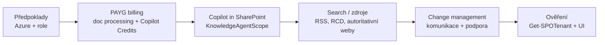

# M · Konfigurace krok za krokem

> Typ: povinný · Den: 2 · Odhad: PM blok
> Prostředí: viz [`../../environment.md`](../../environment.md) · Názvosloví: [`../../GLOSSARY.md`](../../GLOSSARY.md)

## Cíle

- Student zná pořadí kroků: předpoklady → PAYG billing → zapnutí Copilot in SharePoint → rozsah → ověření.
- Student rozlišuje dva PAYG modely a umí nastavit Copilot Credits billing policy (vč. toho, proč budget není limit).
- Student umí přečíst a interpretovat `KnowledgeAgentScope` a související ovladače.
- Student odchází s konfiguračním runbookem (dry-run z labu) včetně change-management kroků.

## Výklad

### Krok 0 — předpoklady

- **Azure subscription ve stejném tenantu** — M365 nemá vlastní usage billing; všechny PAYG metry se účtují přes Azure. Subscription v cizím tenantu nejde použít.
- **Resource group v té subscription** — na ni se váže meter a tečou do ní usage data; kdo má na RG aspoň *read*, vidí náklady v Cost Management. Tím se řídí, kdo v organizaci smí vidět AI útratu.
- **Role**: podle služby (viz krok 1) + vždy **Owner/Contributor na subscription**. Dvě nezávislé osy — M365 admin role sama nestačí.

### Krok 1 — PAYG billing (dva modely)

Dva **nezávislé** PAYG modely se stejnou Azure plumbing — nezaměňovat (viz [glosář](../../GLOSSARY.md)):

#### 1a — Document processing PAYG

Aktivace: M365 admin center → **Setup → Billing and licenses → Activate pay-as-you-go services** → tab **Billing** → **Document processing services**; pozdější správa **Settings → Org settings → Pay-as-you-go services** ([Set up PAYG billing](https://learn.microsoft.com/en-us/microsoft-365/documentprocessing/syntex-azure-billing)). Význam sekcí panelu **Set up billing and turn on services**:

- **Azure subscription** — přes koho tečou peníze (Owner/Contributor nutný).
- **Resource group** — kam se váže meter; v Azure **Cost analysis** pak filtr *Product* + tag *Site* ukáže útratu per web (latence až 24 h).
- **Region** — kde budou uložena **usage metadata** (tenant ID, názvy webů). Data-residency rozhodnutí, ne výkonové — obsah dokumentů zůstává v tenantu.
- **Terms of service** — samostatné PAYG podmínky (jiný právní režim než M365 subscription).

Odemyká doc processing služby (Autofill columns, OCR, translation, eSignature, …) a je to stejná plumbing, na kterou navazují Backup/Archive/Storage metry (D4). Role: SharePoint nebo Global Admin.

#### 1b — Copilot Credits PAYG (Copilot bez licencí)

Usage-based přístup ke Copilot službám bez plné M365 Copilot licence — účtuje se za **Copilot Credits**. Pokrývá: **M365 Copilot Chat** (placené funkce = grounding nad tenant daty), **SharePoint agents**, Copilot Retrieval API (preview); Copilot Studio má PAYG vlastní ([Overview](https://learn.microsoft.com/en-us/microsoft-365/copilot/pay-as-you-go/overview) · [Setup](https://learn.microsoft.com/en-us/microsoft-365/copilot/pay-as-you-go/setup)). Setup je **dvoukrokový** — a ty kroky mají různý význam:

1. **Billing policy** (admin center → **Copilot → Billing & usage** → tab **Billing policies** → *Add a billing policy*): účetní identita = Azure subscription + resource group + region + **users/groups** (komu se smí účtovat) + volitelný budget. Policy odděluje *kdo platí* od *co se platí* — proto jich lze mít až 50 (např. per oddělení) a jednu policy připojit k více službám.
2. **Connect policy ke službě** (tab **Pay-as-you-go services** → *Microsoft 365 Copilot Chat* / *SharePoint agents* → vybrat policy): **teprve tohle** službu uživatelům z policy zpřístupní. Samotná policy nic nezapíná; disconnect přístup odebírá (propagace do ~2 h).

- **Budget ≠ limit.** Budget jen posílá e-mailové notifikace při milnících útraty — **strop nevynucuje**, služba běží dál i po překročení. Tvrdý limit neexistuje; hlídá se přes notifikace + Cost Management. Nosný teaching point do komunikačního plánu (lab, krok 3).
- Role: Billing Admin / **AI Administrator** / Global Admin; **Global Reader vidí read-only** — přesně náš studentský model (ověření v labu).
- Ověření funkčnosti: uživatel bez licence zkusí agenta (např. *Learning Coach*), základní prompt ≈ 12 kreditů; útrata pak v **Copilot Credits Report**.

### Krok 2 — zapnutí Copilot in SharePoint

- Stav: **preview, od poloviny června 2026 opt-out** — default zapnuto pro uživatele s **M365 Copilot licencí** ([Get started with Copilot in SharePoint](https://learn.microsoft.com/en-us/sharepoint/copilot-in-sharepoint-get-started)).
- Rozsah řídí `Set-SPOTenant -KnowledgeAgentScope` — hodnoty `AllSites` | `IncludeSelectedSites` | `ExcludeSelectedSites` | `NoSites` (default `NoSites`); výběr webů `KnowledgeAgentSelectedSitesList` (max 100) + `...Operation` (Overwrite/Append/Remove). Parametry drží preview jméno „KnowledgeAgent" kvůli kompatibilitě.
- Další ovladače: **Site AI settings** (vlastník webu), **Restricted Content Discovery** (přebíjí scope — web s RCD Copilot nevidí, most na D3 SAM).

### Krok 3 — vyhledávání a zdroje

Grounding jede přes Microsoft Graph a search — co není v indexu / na co nejsou práva, Copilot nenajde. Restricted SharePoint Search a RCD jsou vypínače viditelnosti; autoritativní obsah lze značit (`-IsAuthoritative`, viz ranní PowerShell).

Detailní výklad tří ovladačů (scope × RCD × IsAuthoritative) vč. kombinačních scénářů a častých omylů: [`explainer-copilot-controls.md`](explainer-copilot-controls.md).

### Krok 4 — change management a komunikace

Technický rollout je menší půlka. Komunikační plán: co se zapíná, koho se to týká, co s náklady (PAYG!), kam hlásit problémy. Vzory: [Copilot enablement resources](https://learn.microsoft.com/en-us/microsoft-365/copilot/microsoft-365-copilot-enablement-resources) (5 kroků: readiness → licence → apps/network → setup → welcome + feedback).

## Klíčové rozlišení

- **Licence vs. PAYG u Copilot in SharePoint**: preview je license-based (M365 Copilot, bez příplatku). Copilot Credits PAYG (krok 1b) dokumentovaně kryje **Copilot Chat a SharePoint agents** — zda odemkne i Copilot in SharePoint pro nelicencované uživatele, dokumentace neříká. Přesně náš případ (tenant bez Copilot licencí) — ověřovat živě.
- **Billing policy vs. connect**: policy je jen účetní identita (kdo + přes co platí); přístup ke službě vzniká až připojením policy ke konkrétní službě. Dva kroky = dvě různá rozhodnutí.
- **Zapnout vs. zpřístupnit**: `KnowledgeAgentScope` říká *kde* funkce smí běžet; licence/kredity říkají *kdo* ji smí použít; permissions říkají *nad čím*. Tři nezávislé vypínače.

## Naše prostředí

- Konfigurace = **instruktorské demo** (tenant-wide + admin role). Studenti: dry-run runbook (lab) + ověření dopadu jako Global Reader (admin centrum read-only, `Get-SPOTenant` dle ranního go/no-go).

## Lab

Viz [`lab-config-dry-run.md`](lab-config-dry-run.md) — tenant configuration dry-run (simulace).

## Zdroje (Microsoft)

[Get started with Copilot in SharePoint](https://learn.microsoft.com/en-us/sharepoint/copilot-in-sharepoint-get-started) · [Set up pay-as-you-go billing (doc processing)](https://learn.microsoft.com/en-us/microsoft-365/documentprocessing/syntex-azure-billing) · [Copilot pay-as-you-go overview](https://learn.microsoft.com/en-us/microsoft-365/copilot/pay-as-you-go/overview) · [Set up Copilot pay-as-you-go](https://learn.microsoft.com/en-us/microsoft-365/copilot/pay-as-you-go/setup) · [Copilot enablement resources](https://learn.microsoft.com/en-us/microsoft-365/copilot/microsoft-365-copilot-enablement-resources)

## Stav produktu / delta

> [!WARNING] Ověřit k datu běhu — stav k 2026-07.
> Copilot in SharePoint je preview a MS avizuje, že **enablement se při GA změní** — před během zkontrolovat get-started stránku. Parametry zatím `KnowledgeAgent*`; opt-out default běží od 6/2026. Nedostupné v GCC/GCC High/DoD.
> Copilot Credits PAYG (Copilot → Billing & usage) je čerstvé — cesty v admin centru a chování budgetu (zatím jen notifikace, ne vynucený strop) ověřit v tenantu před během; cena za kredit dle glosáře, ověřit v ceníku.
