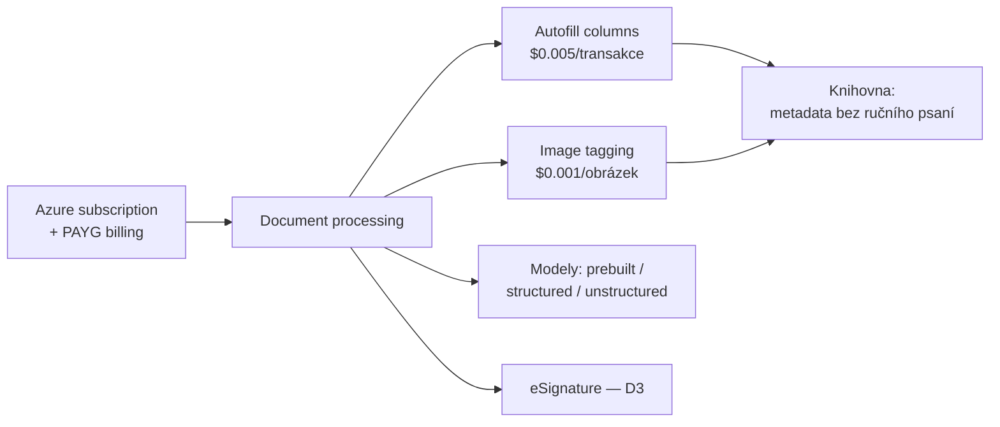

# Základy Document processing for Microsoft 365

> Typ: povinný · Den: 2 (největší blok dne) · Odhad: dlouhý PM blok — živá konfigurace + 2 dema + lab
> Prostředí: viz [`../../environment.md`](../../environment.md) · Názvosloví: [`../../GLOSSARY.md`](../../GLOSSARY.md)

## Cíle

- Student zná rodinu 10 služeb Document processing a jejich čistě PAYG licencování.
- Student viděl **živě** konfiguraci služeb, **autofill columns** a **image tagging** — a umí je zopakovat na vlastní knihovně.
- Student ví, kde náklady vznikají a jak je sledovat (observabilita).

## Výklad

### Co rodina obsahuje

**Document processing for Microsoft 365** (ex-Syntex, viz glosář) = 10 služeb: autofill columns, document translation, eSignature, OCR, content assembly, image tagging, taxonomy tagging, prebuilt / structured & freeform / unstructured modely ([Overview](https://learn.microsoft.com/en-us/microsoft-365/documentprocessing/syntex-overview)). Licenčně **čistý PAYG** — žádný upfront závazek, platí se použití. Výjimka: **structured a freeform modely jsou AI Builder** (Power Platform) a přes M365 PAYG se neúčtují — srovnání typů modelů vč. Dataverse napojení a jazyků: [`comparison-models.md`](comparison-models.md).

### Konfigurace (živě v bloku)

Cesta: M365 admin center → **Settings → Org settings → Pay-as-you-go services → Settings → Document & image services** ([Set up](https://learn.microsoft.com/en-us/microsoft-365/documentprocessing/set-up-microsoft-syntex)). Po propojení PAYG jsou autofill i image tagging **automaticky zapnuté pro všechny weby** — rozsah se dá omezit (All / Selected max 100 / No sites).

### Demo 1 — Autofill columns

Sloupec knihovny, který AI vyplní z obsahu dokumentu (extrakce/sumarizace podle promptu sloupce). Účtuje se za transakci ([Autofill setup](https://learn.microsoft.com/en-us/microsoft-365/documentprocessing/autofill-setup)). Poznámka k překryvu: autofill je v preview **součástí Copilot in SharePoint** — s Copilot licencí běží bez PAYG setupu; bez ní jede přes PAYG (náš případ).

### Demo 2 — Image tagging

Automatické tagování obrázků do sloupce spravovaných metadat; **účtuje se jen na knihovnách, kde je zapnuté** ([Image tagging setup](https://learn.microsoft.com/en-us/microsoft-365/documentprocessing/image-tagging-setup)). Návaznost: tagy = použitelná metadata pro search i Copilot grounding.

### Náklady a observabilita

Ceník za službu (autofill $0.005/txn, image tagging $0.001/obrázek, unstructured $0.005/txn, prebuilt $0.01/txn, eSignature $2/request…) — [PAYG pricing](https://learn.microsoft.com/en-us/microsoft-365/documentprocessing/syntex-pay-as-you-go-services). Spotřeba se sleduje v **Azure Cost Management** nad resource group (zpoždění až 24 h). Kalkulačka: aka.ms/SharePoint/PAYG-Calculator.

## Klíčové rozlišení

- **Document processing PAYG ≠ Copilot Credits** — nosné rozlišení celého kurzu (glosář): tady se platí za dokumenty/obrázky/transakce, Copilot Credits za AI konverzace.
- **Autofill vs. modely**: autofill = per-sloupec prompt, minuty nastavení; structured/unstructured modely = trénovaný extraktor pro opakované typy dokumentů. Začínat autofillem, model až když sloupců a pravidel přibývá.
- **Zapnuto vs. účtováno**: služby jsou po PAYG setupu „zapnuté" všude, ale image tagging se účtuje až aktivací na knihovně — rozdíl mezi dostupností a spotřebou.

## Naše prostředí

- Konfiguraci a obě dema předvádí **instruktor živě**; studenti pak totéž zopakují na knihovně vlastního webu (lab). PAYG je aktivní — každý dokument/obrázek stojí peníze, lab má záměrně malý vzorek.

## Lab

Viz [`lab-sample-library.md`](lab-sample-library.md) — nastavení ukázkové knihovny.

## Zdroje (Microsoft)

[Overview of document processing](https://learn.microsoft.com/en-us/microsoft-365/documentprocessing/syntex-overview) · [Set up pay-as-you-go services](https://learn.microsoft.com/en-us/microsoft-365/documentprocessing/set-up-microsoft-syntex) · [Autofill columns](https://learn.microsoft.com/en-us/microsoft-365/documentprocessing/autofill-setup) · [Enhanced image tagging](https://learn.microsoft.com/en-us/microsoft-365/documentprocessing/image-tagging-setup) · [PAYG pricing](https://learn.microsoft.com/en-us/microsoft-365/documentprocessing/syntex-pay-as-you-go-services)

## Stav produktu / delta

> [!WARNING] Ověřit k datu běhu — stav k 2026-07.
> Promo „měsíční kapacita zdarma" končí **červen 2026** — ověřit, zda ještě platí, jinak vyhodit ze slidů. Autofill překryv s Copilot in SharePoint (preview) se při GA může změnit. Ceny průběžně revidovat proti pricing stránce; docs jedou pod `/documentprocessing/`, staré `/syntex/` URL redirectují.
> **AI Builder kredity** (structured/freeform modely) končí k 1. 11. 2026 — náhrada Copilot Credits; detail v [`comparison-models.md`](comparison-models.md).
