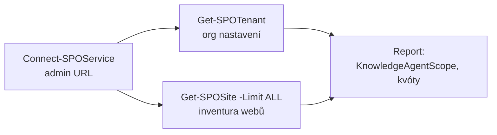

# SharePoint PowerShell (SPO Management Shell)

> Typ: povinný · Den: 2 · Odhad: AM blok · Varianta B: studenti píšou skripty
> Prostředí: viz [`../../environment.md`](../../environment.md) · Názvosloví: [`../../GLOSSARY.md`](../../GLOSSARY.md)

## Cíle

- Student nainstaluje a připojí **SPO Management Shell** a přečte stav tenantu přes `Get-*` cmdlety.
- Student napíše krátký reportovací skript (weby + vlastnosti relevantní pro AI governance).
- Student ví, které operace jsou tenant-wide a proč je v kurzu spouští jen instruktor.

## Výklad

### Modul a připojení

- Modul: **`Microsoft.Online.SharePoint.PowerShell`** — `Install-Module -Name Microsoft.Online.SharePoint.PowerShell -Scope CurrentUser` ([Get started](https://learn.microsoft.com/en-us/powershell/sharepoint/sharepoint-online/connect-sharepoint-online)).
- PowerShell 7: `Import-Module Microsoft.Online.SharePoint.PowerShell -UseWindowsPowerShell`.
- Připojení na **admin URL**: `Connect-SPOService -Url https://<tenant>-admin.sharepoint.com` (interaktivní sign-in, MFA OK).
- **Role:** dokumentace vyžaduje **SharePoint Administrator** ([Intro](https://learn.microsoft.com/en-us/powershell/sharepoint/sharepoint-online/introduction-sharepoint-online-management-shell)) — dopad na náš role model viz Naše prostředí.

### Čtení stavu tenantu

- **`Get-SPOTenant`** — org-level vlastnosti vč. `KnowledgeAgentScope` (rozsah Copilot in SharePoint — most na odpolední konfiguraci) ([Get-SPOTenant](https://learn.microsoft.com/en-us/powershell/module/microsoft.online.sharepoint.powershell/get-spotenant)).
- **`Get-SPOSite`** — inventura webů; default `-Limit 200`, plný výpis `-Limit ALL`; s `-Limit`/`-Filter` řada vlastností vrací defaulty (SharingCapability, SensitivityLabel…) — pro detail číst web jednotlivě ([Get-SPOSite](https://learn.microsoft.com/en-us/powershell/module/microsoft.online.sharepoint.powershell/get-sposite)).
- AI-relevantní novinka: parametr **`-IsAuthoritative`** — označuje weby s „oficiálním" obsahem pro Search/Copilot/agenty.

### Set-* = tenant-wide

`Set-SPOTenant` mění **sdílený stav pro všech 20 studentů najednou** — proto v kurzu zapisuje jen instruktor (demo), studenti čtou a píšou skripty.

## Klíčové rozlišení

- **SPO Management Shell vs. PnP.PowerShell**: kurz jede na SPO modulu (pokrývá tenant admin, SAM, `KnowledgeAgentScope`); PnP je komunitní nástroj pro obsah webů — mimo rozsah kurzu (viz glosář).
- **Get vs. Set**: čtení je bezpečné a paralelní; zápis je tenant-wide a výhradně instruktorský. Skript se píše tak, aby šel *nejdřív* spustit jen se čtením.

## Naše prostředí

- Dokumentované minimum pro připojení je SharePoint Administrator — studenti ho **nemají** (viz `environment.md`). Průběh: studenti **píšou skripty** (varianta B) a spouštějí je podle go/no-go instruktora — buď pod dočasně přiděleným přístupem, nebo je spouští instruktor na projektoru; viz instructor-notes.

## Lab

Viz [`lab-spo-scripting.md`](lab-spo-scripting.md) — inventura tenantu skriptem.

Navazující návod: [`guide-copilot-inventory.md`](guide-copilot-inventory.md) — inventarizace nastavení Copilot in SharePoint (scope + RCD → efektivní dostupnost per web).

## Zdroje (Microsoft)

[Get started with SPO Management Shell](https://learn.microsoft.com/en-us/powershell/sharepoint/sharepoint-online/connect-sharepoint-online) · [Intro to SPO Management Shell](https://learn.microsoft.com/en-us/powershell/sharepoint/sharepoint-online/introduction-sharepoint-online-management-shell) · [Cmdlet reference](https://learn.microsoft.com/en-us/powershell/module/microsoft.online.sharepoint.powershell/?view=sharepoint-ps) · [Get-SPOSite](https://learn.microsoft.com/en-us/powershell/module/microsoft.online.sharepoint.powershell/get-sposite?view=sharepoint-ps) · [Get-SPOTenant](https://learn.microsoft.com/en-us/powershell/module/microsoft.online.sharepoint.powershell/get-spotenant?view=sharepoint-ps) · [Get started with Copilot in SharePoint](https://learn.microsoft.com/en-us/sharepoint/copilot-in-sharepoint-get-started)

## Stav produktu / delta

> [!WARNING] Ověřit k datu běhu — stav k 2026-07.
> Copilot funkce vyžadují modul 16.0.26615.12013+ — před kurzem aktualizovat. Zda `Get-*` cmdlety fungují pod Global Reader, dokumentace neříká (uvádí jen SharePoint Administrator) — otestovat v tenantu před během, viz instructor-notes.
> Copilot in SharePoint je od 2026-06 **opt-out preview** (zapíná se automaticky licencovaným uživatelům); parametry si drží preview názvy `KnowledgeAgent*`. Enablement se má pro GA změnit — před během ověřit v článku [Get started with Copilot in SharePoint](https://learn.microsoft.com/en-us/sharepoint/copilot-in-sharepoint-get-started).
