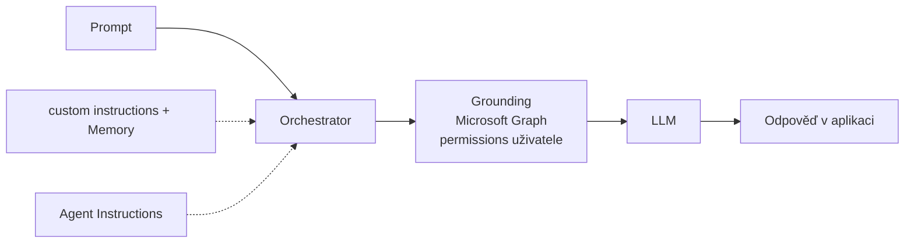

# M · Základy promptování a agentní anatomie

> Typ: povinný · Den: 2 (otvírák) · Odhad: AM blok
> Prostředí: viz [`../../environment.md`](../../environment.md) · Názvosloví: [`../../GLOSSARY.md`](../../GLOSSARY.md)

## Cíle

- Student napíše prompt se čtyřmi částmi (cíl, kontext, očekávání, zdroj) a umí iterovat.
- Student vysvětlí roli Orchestratoru: co se s promptem děje mezi odesláním a odpovědí.
- Student rozliší pojmy: **Prompt · Orchestrator · Context · custom instructions · Memory · Agent Instructions** — a ví, kdo kterou vrstvu nastavuje.

## Výklad

### 1. Anatomie promptu

Čtyři části — povinný je jen cíl ([Writing prompts](https://support.microsoft.com/en-us/microsoft-365-copilot/get-started-writing-prompts-in-microsoft-365-copilot)):

| Část | Otázka | Příklad |
|---|---|---|
| **Cíl** | Co chci? | „Shrň reklamační proces…" |
| **Kontext** | Proč a pro koho? | „…pro nového kolegu na helpdesku…" |
| **Očekávání** | Jak má vypadat výstup? | „…jako 5 odrážek česky…" |
| **Zdroj** | Odkud čerpat? | „…z dokumentů v této knihovně." |

Promptování je **iterace** — první odpověď je začátek konverzace, ne konec. A výstupy se ověřují: model může generovat nesprávný obsah.

### 2. Orchestrator — co se děje s promptem

Prompt → **grounding přes Microsoft Graph** v tenantu (jen to, na co má uživatel práva — RBAC) → obohacený prompt do LLM → odpověď. Vše uvnitř **Microsoft 365 service boundary**; respektuje Conditional Access a MFA ([Copilot architecture](https://learn.microsoft.com/en-us/microsoft-365/copilot/microsoft-365-copilot-architecture)).

### 3. Vrstvy instrukcí — kdo mluví do odpovědi

| Vrstva | Kdo nastavuje | Trvání | Kde |
|---|---|---|---|
| **Prompt** | uživatel | jedna otázka | chat |
| **Context** | konverzace + grounding | jedna session | context window |
| **custom instructions** | uživatel | trvale (jeho profil) | Copilot nastavení |
| **Memory** | Copilot (odvozené) + uživatel | trvale | skrytá složka v Exchange mailboxu |
| **Agent Instructions** | tvůrce agenta | život agenta | manifest agenta (max 8 000 znaků) |

- **Memory a personalizace** jsou **preview** (Frontier program); fungují i pro Copilot Chat bez plné licence; admin ovladač „Enhanced personalization" je default ON; Purview retence ani audit se na paměť nevztahují ([Manage personalization & memory](https://learn.microsoft.com/en-us/microsoft-365/copilot/copilot-personalization-memory)).
- **Agent Instructions**: struktura purpose → guidelines → skills, psané v Markdownu; **nikdy nedávat instrukce do knowledge zdrojů** (riziko cross-prompt injection, XPIA) ([Declarative agent instructions](https://learn.microsoft.com/en-us/microsoft-365/copilot/extensibility/declarative-agent-instructions)).

## Klíčové rozlišení

- **Context vs. Memory**: context = pracovní paměť jedné konverzace (zmizí); Memory = trvalé poznámky o uživateli napříč konverzacemi.
- **custom instructions vs. Agent Instructions**: první říká „jak mluvit se MNOU" (nastavuje uživatel sobě), druhé „jak se chová AGENT" (nastavuje tvůrce všem uživatelům agenta).
- **Grounding vs. context**: grounding = co orchestrator *dohledá* v tenantu (permissions-trimmed); context = co už *je* v konverzaci.

## Naše prostředí

- Lab běží živě nad Copilot in SharePoint na vlastním webu (PAYG — každá iterace stojí kredity; učíme se iterovat chytře, ne donekonečna).

## Lab

Viz [`lab-prompt-anatomy.md`](lab-prompt-anatomy.md) — anatomie promptu nad vlastním obsahem.

## Zdroje (Microsoft)

[Get started writing prompts](https://support.microsoft.com/en-us/microsoft-365-copilot/get-started-writing-prompts-in-microsoft-365-copilot) · [How does Microsoft 365 Copilot work?](https://learn.microsoft.com/en-us/microsoft-365/copilot/microsoft-365-copilot-architecture) · [Manage Copilot personalization and memory](https://learn.microsoft.com/en-us/microsoft-365/copilot/copilot-personalization-memory) · [Write effective instructions for declarative agents](https://learn.microsoft.com/en-us/microsoft-365/copilot/extensibility/declarative-agent-instructions) · [Prompt Gallery](https://adoption.microsoft.com/en-us/copilot/prompt-gallery/)

## Stav produktu / delta

> [!WARNING] Ověřit k datu běhu — stav k 2026-07.
> Memory/personalizace = preview (Frontier), chování se mění. Přechod modelů (GPT 5.0 → 5.1) posunul interpretaci instrukcí z literal na intent-first — vzory psaní instrukcí průběžně revidovat dle MS docs.
