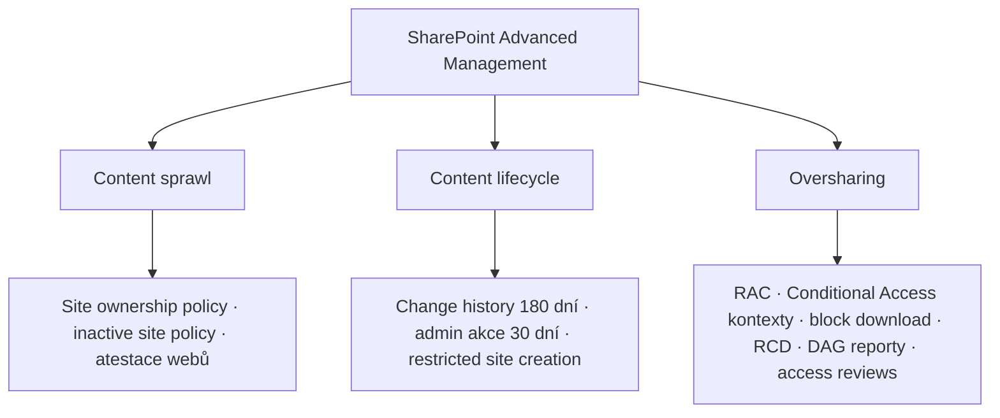

# M · SharePoint Advanced Management (SAM)

> Typ: povinný · Den: 3 · Odhad: AM/PM blok
> Prostředí: viz [`../../environment.md`](../../environment.md) · Názvosloví: [`../../GLOSSARY.md`](../../GLOSSARY.md)

## Cíle

- Student umí zařadit SAM jako **SharePoint vrstvu správy** (weby, obsah, sdílení) v mapě nástrojů pro správu.
- Student zná tři pilíře SAM a umí vybrat politiku pro konkrétní governance problém.
- Student ví, jak se SAM licencuje a proč je to „příprava tenantu na Copilot".

## Výklad

### Tři pilíře SAM

Spravuje se ze SharePoint admin centra ([SAM overview](https://learn.microsoft.com/en-us/sharepoint/advanced-management)):

- **Content sprawl**: politika vlastnictví webů, **inactive site policy** (notifikace vlastníkům), atestace.
- **Content lifecycle**: katalog webů, **change history reporty (180 dní zpět)**, nedávné admin akce (30 dní), omezení zakládání webů aplikacemi.
- **Oversharing** (nejdůležitější pro Copilot): **Restricted Access Control (RAC)** — přístup k webu/OneDrive jen pro security groups; **Restricted Content Discovery (RCD)** — web zůstane přístupný, ale Copilot/search ho negrounduje; **DAG reporty** (permission state, sharing links za 28 dní, EEEU insights, per-user permissions); site access reviews; porovnání politik až přes 10 000 webů.

### Proč před Copilotem

Copilot respektuje permissions — **oversharing se stává AI problémem**: co je přesdílené, Copilot ochotně najde. SAM (DAG reporty → RAC/RCD) je hlavní Microsoft nástroj, jak to srovnat před rolloutem. Tahle nit pokračuje v D4 [`copilot-admin`](../../day-4/copilot-admin/README.md).

### Licencování

- **Jedna přiřazená M365 Copilot licence odemyká SAM funkce pro celý tenant** ([SAM licensing](https://learn.microsoft.com/en-us/sharepoint/sharepoint-advanced-management-licensing)).
- Výjimka: *restricted site creation by apps* vyžaduje **SAM Plan 1 add-on** (per-user); DAG report nad sensitivity labels navíc E5.

## Klíčové rozlišení

- **RAC vs. RCD**: RAC bere lidem *přístup*; RCD bere Copilotu/search *viditelnost* (lidé s odkazem se dostanou dál). Pro „tajné, ale používané" weby je správně RCD, pro „nikdo tam nemá co dělat" RAC.
- **SAM vs. Purview**: SAM řídí *weby a sdílení* (SharePoint vrstva); Purview řídí *data a compliance* (labely, retence, audit). Doplňují se, nenahrazují.
- **Licence vs. permissions** znovu: SAM licence odemyká funkce adminovi; na obsah webů tím admin práva nezískává.

## Naše prostředí

- Politiky aplikuje **instruktor** (SharePoint admin, tenant-wide dopad); studenti jako Global Reader čtou SharePoint admin centrum a ověřují výsledek — viz lab.

## Lab

Viz [`lab-sam-policies.md`](lab-sam-policies.md) — aplikace a ověření politik.

## Zdroje (Microsoft)

[SharePoint Advanced Management overview](https://learn.microsoft.com/en-us/sharepoint/advanced-management) · [SAM licensing](https://learn.microsoft.com/en-us/sharepoint/sharepoint-advanced-management-licensing)

## Stav produktu / delta

> [!WARNING] Ověřit k datu běhu — stav k 2026-07.
> Odemknutí SAM přes Copilot licenci: ověřit, že v kurzovním tenantu (Business Basic + PAYG, bez Copilot seat) jsou SAM funkce vidět — jinak jede blok na screenshotech/demo videu. Feature set SAM roste po měsících (stránka aktualizovaná 2026-06).
