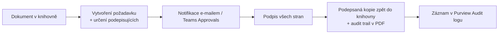

# M · Scénáře eSignature

> Typ: povinný · Den: 3 (otvírák) · Odhad: AM blok
> Prostředí: viz [`../../environment.md`](../../environment.md) · Názvosloví: [`../../GLOSSARY.md`](../../GLOSSARY.md)

## Cíle

- Student umí zasadit SharePoint eSignature do rodiny Document processing a ví, kdy sáhnout po partnerském provideru (Adobe/Docusign).
- Student zná úrovně podpisu dle **eIDAS** (SES/AES/QES) a ví, že SharePoint eSignature = SES — a co z toho plyne pro výběr nástroje.
- Student rozumí schvalovacímu/podpisovému flow (Approvals → podpis) včetně auditovatelnosti a souhry s retencí.
- Student ví, co eSignature stojí (PAYG) a kdo ho zapíná.

## Výklad

### Co to je a kdo podepisuje

- **SharePoint eSignature** = elektronické podepisování dokumentů přímo v SharePointu; služba pod **Document processing for Microsoft 365** (v UI stále „SharePoint eSignature", viz glosář).
- Podpora **PDF i Word** dokumentů (Word vyžaduje Enterprise/Current/Beta channel Office) ([Overview of eSignature](https://learn.microsoft.com/en-us/microsoft-365/documentprocessing/esignature-overview)).
- **Partnerské konektory: Adobe Acrobat Sign a Docusign eSignature** — request se spouští ze SharePointu, podepsaná kopie se ukládá zpět (od rolloutu 2025 do **původní složky**, ne do `Apps\Signed documents`).
- Externí podepisující = **Entra B2B guest** — musí být povolená B2B integrace pro SharePoint/OneDrive.

### Flow podpisu

### Právní rámec — eIDAS (nařízení EU č. 910/2014)

eIDAS definuje tři úrovně elektronického podpisu — a **SharePoint eSignature je dokumentovaně ta nejnižší**: *„The eSignature service uses **simple electronic signatures** as defined under applicable law including, but not limited to, the Regulation (EU) No 910/2014 (the eIDAS Regulation)"* ([Overview](https://learn.microsoft.com/en-us/microsoft-365/documentprocessing/esignature-overview), sekce Legal considerations + [terms of service](https://learn.microsoft.com/en-us/legal/microsoft-365/esignature-terms-of-service)).

| Úroveň | eIDAS | Co vyžaduje | Kdo to umí |
| --- | --- | --- | --- |
| **SES** — prostý el. podpis | čl. 3(10) | data připojená k dokumentu (klik, nakreslený podpis) | **SharePoint eSignature** |
| **AES** — zaručený el. podpis | čl. 26 | jednoznačná vazba na podepisujícího, identifikace, výhradní kontrola, zjistitelnost změn | partnerský provider (Adobe/Docusign) |
| **QES** — kvalifikovaný el. podpis | čl. 3(12) | AES + kvalifikovaný certifikát + kvalifikovaný prostředek (QSCD); **právní účinek vlastnoručního podpisu v celé EU** (čl. 25(2)) | partnerský provider + kvalifikovaný poskytovatel (TSP) |

- **SES není „neplatný"**: čl. 25(1) zakazuje upřít podpisu právní účinky jen proto, že je elektronický — ale důkazní síla se posuzuje případ od případu. Pro běžné obchodní dokumenty (objednávky, interní schválení, NDA dle risk assessmentu) SES typicky stačí.
- **CZ kontext** (zákon č. 297/2016 Sb.): pro právní jednání vůči veřejnoprávním podepisujícím je nutný **uznávaný elektronický podpis** (AES s kvalifikovaným certifikátem nebo QES) — tam SharePoint eSignature nestačí a nastupuje provider s QES podporou.
- Rozhodovací pravidlo do praxe: **úroveň podpisu určuje právník podle typu dokumentu, ne IT podle dostupné technologie** — IT pak vybírá nástroj (nativní SES vs. provider).

### Souhra se schvalováním (Approvals)

- **Teams Approvals app**: eSignature requesty se v ní dají sledovat nativně (release notes v Overview) — schvalovatel i žadatel vidí stav podpisu vedle běžných schválení. Approvals app zároveň umí vlastní schválení s podpisem přes Adobe Acrobat Sign / Docusign šablony.
- **Power Automate vzor „schválit → podepsat"**: Approvals konektor (souhlas s postupem) → po schválení Adobe/Docusign konektorem (nebo ručně nativním eSignature) odeslat k podpisu → podepsaná kopie zpět do knihovny → retention label. Přímý Power Automate konektor pro *nativní* SharePoint eSignature zatím není — automatizace podpisového kroku vede přes partnerské konektory (most na odpolední `power-automate-invoices`).
- Pořadí drží Klíčové rozlišení níže: Approvals odpovídá na „smíme?", eSignature na „stvrzujeme" — nezaměňovat a nekombinovat obráceně.

### Governance, audit, retence

- Aktivity eSignature se logují do **Purview Audit logu** (hledej `eSignature*`) — návaznost na D4 monitoring.
- Pracovní kopie žije ve skryté knihovně a drží se **5 let, nebo dle Purview retention policy tenantu** — retence má přednost.
- Odkazy v e-mailech expirují **30 dní** po dokončení/zamítnutí.
- Sensitivity label webu může zablokovat externí požadavky (pokud label nepovoluje external sharing).

### Licencování a zapnutí

- **Jen PAYG** — žádné per-user SKU; vyžaduje propojenou Azure subscription (Document processing PAYG model, viz glosář).
- Zapíná SharePoint/Global Admin: M365 admin center → Settings → Org settings → **Pay-as-you-go services** → eSignature; rozsah **všechny weby, nebo max 100 vybraných**; provider(y) na stejném panelu; plně funkční do 24 h ([Set up eSignature](https://learn.microsoft.com/en-us/microsoft-365/documentprocessing/esignature-setup)).

## Klíčové rozlišení

- **eSignature vs. Approvals**: Approvals (Teams/Power Automate) = souhlas s postupem; eSignature = právně relevantní podpis dokumentu s audit trailem. Často se kombinují (schválit → podepsat).
- **Microsoft vs. partner provider**: Microsoft eSignature účtuje PAYG za request; přes Adobe/Docusign se PAYG nic neúčtuje (setup ale PAYG vyžaduje) — platíš licenci providera. **Kdy provider povinně**: potřeba AES/QES úrovně (viz eIDAS výše), podpisy vůči veřejné správě (CZ: uznávaný podpis), pokročilé workflow providera. Pozor: integrace Adobe/Docusign v SharePointu jede **jen nad PDF** (nativní eSignature umí i Word).
- **SES vs. AES/QES**: technicky vypadá podpis podobně (audit trail, certifikát dokončení) — právně jsou to tři různé kategorie. Audit trail SES ≠ kvalifikovaný certifikát QES.

## Naše prostředí

- Tenant má PAYG nastavený (viz `environment.md`); zapnutí eSignature = **instruktorské demo** (vyžaduje admin). Studenti si flow projdou v simulaci — viz lab.

## Lab

Viz [`lab-esignature-flow.md`](lab-esignature-flow.md) — eSignature schvalovací flow (simulace).

## Zdroje (Microsoft)

[Overview of eSignature](https://learn.microsoft.com/en-us/microsoft-365/documentprocessing/esignature-overview) · [Set up eSignature](https://learn.microsoft.com/en-us/microsoft-365/documentprocessing/esignature-setup) · [eSignature terms of service](https://learn.microsoft.com/en-us/legal/microsoft-365/esignature-terms-of-service) · [Nařízení (EU) č. 910/2014 — eIDAS (EUR-Lex)](https://eur-lex.europa.eu/legal-content/CS/TXT/?uri=CELEX%3A32014R0910)

## Stav produktu / delta

> [!WARNING] Ověřit k datu běhu — stav k 2026-07.
> Promo „až 5 requestů zdarma" platí do června 2026 — před během ověřit, jestli ještě běží. Seznam partnerských providerů (Adobe, Docusign) se může rozšířit. Docs se přestěhovaly z `/syntex/` na `/documentprocessing/` — staré URL redirectují.
> **eIDAS 2.0** (nařízení (EU) 2024/1183, EUDI Wallet) postupně nabíhá — úrovně SES/AES/QES zůstávají, přibývá peněženka jako podpisový prostředek; před během zkontrolovat, zda Microsoft/provideři neohlásili podporu. Zda nativní eSignature nezískal Power Automate konektor, ověřit v konektorové galerii.
