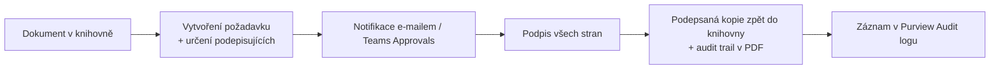

# M · Scénáře eSignature

> Typ: povinný · Den: 3 (otvírák) · Odhad: AM blok
> Prostředí: viz [`../../environment.md`](../../environment.md) · Názvosloví: [`../../GLOSSARY.md`](../../GLOSSARY.md)

## Cíle

- Student umí zasadit SharePoint eSignature do rodiny Document processing a ví, kdy sáhnout po partnerském provideru.
- Student rozumí schvalovacímu/podpisovému flow včetně auditovatelnosti a souhry s retencí.
- Student ví, co eSignature stojí (PAYG) a kdo ho zapíná.

## Výklad

### Co to je a kdo podepisuje

- **SharePoint eSignature** = elektronické podepisování dokumentů přímo v SharePointu; služba pod **Document processing for Microsoft 365** (v UI stále „SharePoint eSignature", viz glosář).
- Podpora **PDF i Word** dokumentů (Word vyžaduje Enterprise/Current/Beta channel Office) ([Overview of eSignature](https://learn.microsoft.com/en-us/microsoft-365/documentprocessing/esignature-overview)).
- **Partnerské konektory: Adobe Acrobat Sign a Docusign eSignature** — request se spouští ze SharePointu, podepsaná kopie se ukládá zpět (od rolloutu 2025 do **původní složky**, ne do `Apps\Signed documents`).
- Externí podepisující = **Entra B2B guest** — musí být povolená B2B integrace pro SharePoint/OneDrive.

### Flow podpisu

### Governance, audit, retence

- Aktivity eSignature se logují do **Purview Audit logu** (hledej `eSignature*`) — návaznost na D4 monitoring.
- Pracovní kopie žije ve skryté knihovně a drží se **5 let, nebo dle Purview retention policy tenantu** — retence má přednost.
- Odkazy v e-mailech expirují **30 dní** po dokončení/zamítnutí.
- Sensitivity label webu může zablokovat externí požadavky (pokud label nepovoluje external sharing).

### Licencování a zapnutí

- **Jen PAYG** — žádné per-user SKU; vyžaduje propojenou Azure subscription (Document processing PAYG model, viz glosář).
- Zapíná SharePoint/Global Admin: M365 admin center → Settings → Org settings → **Pay-as-you-go services** → eSignature; rozsah **všechny weby, nebo max 100 vybraných**; provider(y) na stejném panelu; plně funkční do 24 h ([Set up eSignature](https://learn.microsoft.com/en-us/microsoft-365/documentprocessing/esignature-setup)).

## Klíčové rozlišení

- **eSignature vs. Approvals**: Approvals (Teams/Power Automate) = souhlas s postupem; eSignature = právně relevantní podpis dokumentu s audit trailem. Často se kombinují (schválit → podepsat).
- **Microsoft vs. partner provider**: Microsoft eSignature účtuje PAYG za request; přes Adobe/Docusign se PAYG nic neúčtuje (setup ale PAYG vyžaduje) — platíš licenci providera.

## Naše prostředí

- Tenant má PAYG nastavený (viz `environment.md`); zapnutí eSignature = **instruktorské demo** (vyžaduje admin). Studenti si flow projdou v simulaci — viz lab.

## Lab

Viz [`lab-esignature-flow.md`](lab-esignature-flow.md) — eSignature schvalovací flow (simulace).

## Zdroje (Microsoft)

[Overview of eSignature](https://learn.microsoft.com/en-us/microsoft-365/documentprocessing/esignature-overview) · [Set up eSignature](https://learn.microsoft.com/en-us/microsoft-365/documentprocessing/esignature-setup)

## Stav produktu / delta

> [!WARNING] Ověřit k datu běhu — stav k 2026-07.
> Promo „až 5 requestů zdarma" platí do června 2026 — před během ověřit, jestli ještě běží. Seznam partnerských providerů (Adobe, Docusign) se může rozšířit. Docs se přestěhovaly z `/syntex/` na `/documentprocessing/` — staré URL redirectují.
