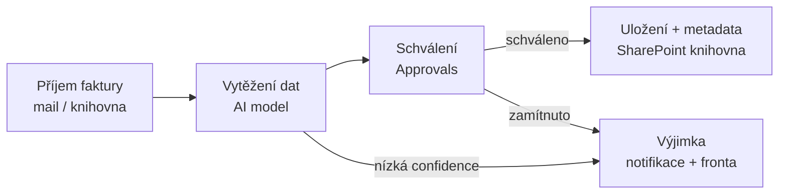

# M · Power Automate — příchozí faktury

> Typ: povinný · Den: 3 · Odhad: krátký PM blok — **jen výklad + instruktorské demo, bez labu**
> Prostředí: viz [`../../environment.md`](../../environment.md) · Názvosloví: [`../../GLOSSARY.md`](../../GLOSSARY.md)

## Cíle

- Student umí načrtnout end-to-end flow příchozí faktury: příjem → vytěžení → schválení → uložení s metadaty.
- Student zná tři cesty vytěžování (AI Builder, Document processing, **Azure AI Document Intelligence**) a umí vybrat.
- Student ví, kde flow provozně bolí (výjimky, limity, deprecated triggery).

## Výklad

### Anatomie flow

- **Trigger**: knihovna — „When a file is created (properties only)". Pozor: triggery „...in a folder" jsou **deprecated**, v designeru ale pořád vidět ([SharePoint connector triggers](https://learn.microsoft.com/en-us/sharepoint/dev/business-apps/power-automate/sharepoint-connector-actions-triggers)).
- **Schválení**: akce **Start and wait for an approval**; odpověď z e-mailu, Teams i mobilu. Nad 30 dní → „Create an approval (v2)" + druhý flow na odpovědi ([Approvals](https://learn.microsoft.com/en-us/power-automate/modern-approvals)).
- **Výjimky a mantinely**: větev pro nízkou confidence, retry policy, limit AI Builderu 360 volání/prostředí/60 s — provozní runbook viz D4 [`monitoring`](../../day-4/monitoring/README.md).

### Tři cesty vytěžení — a proč akcentujeme Azure

| Cesta | Co to je | Kdy |
|---|---|---|
| **AI Builder — invoice processing** | prebuilt model v Power Platform, low-code, umí **češtinu i slovenštinu**, ~30 polí vč. DIČ (`VendorTaxId`), IBAN ([prebuilt invoice model](https://learn.microsoft.com/en-us/ai-builder/prebuilt-invoice-processing)) | rychlý start uvnitř flow, AI Builder kredity |
| **Document processing for M365** | SharePoint-native (prebuilt/structured/unstructured modely, D2) | metadata v knihovně, bez flow logiky |
| **Azure AI Document Intelligence** | `prebuilt-invoice` v4.0 GA, 27 jazyků, až 2 000 stran, plná kontrola přes API ([prebuilt-invoice](https://learn.microsoft.com/en-us/azure/ai-services/document-intelligence/prebuilt/invoice)) | **doporučená cesta pro objem a robustnost** — verzované API, vyšší limity, nezávislost na Power Platform kreditech |

> [!IMPORTANT] Názvosloví
> „Azure Cognitive Services" je zastaralý brand: Form Recognizer → **Azure AI Document Intelligence** (2023), dnes pod deštníkem **Microsoft Foundry** („Foundry Tools") ([overview](https://learn.microsoft.com/en-us/azure/ai-services/document-intelligence/overview)). V materiálech říkáme Azure AI Document Intelligence. Účtuje se přes Azure — třetí kategorie vedle obou M365 PAYG modelů (viz glosář).

## Klíčové rozlišení

- **AI Builder vs. Document Intelligence**: stejná úloha, jiný kontrakt — AI Builder = kredity + limity Power Platformy, low-code; Document Intelligence = Azure služba s SLA, verzemi API a cenou za stránku. Pro 20 faktur/měsíc AI Builder stačí; pro účtárnu s tisícovkami je Azure robustnější.
- **Vytěžení vs. schválení**: AI dává *návrh dat s confidence*; rozhodnutí zůstává na člověku (Approvals). Nikdy nepouštět nízkou confidence rovnou do metadat.

## Naše prostředí

- **Bez labu.** Instruktor předvede demo flow (trigger → AI Builder vytěžení → approval → metadata). Studenti flow využijí v D3 bloku 4 jako podklad pro návrh rozšíření.

## Zdroje (Microsoft)

[Approvals v Power Automate](https://learn.microsoft.com/en-us/power-automate/modern-approvals) · [SharePoint connector — triggery a akce](https://learn.microsoft.com/en-us/sharepoint/dev/business-apps/power-automate/sharepoint-connector-actions-triggers) · [AI Builder invoice processing](https://learn.microsoft.com/en-us/ai-builder/prebuilt-invoice-processing) · [Azure AI Document Intelligence overview](https://learn.microsoft.com/en-us/azure/ai-services/document-intelligence/overview) · [Prebuilt invoice model](https://learn.microsoft.com/en-us/azure/ai-services/document-intelligence/prebuilt/invoice)

## Stav produktu / delta

> [!WARNING] Ověřit k datu běhu — stav k 2026-07.
> „Foundry Tools" rebrand je čerstvý — MS stránky míchají názvy Azure Document Intelligence / Foundry; před během zkontrolovat aktuální titulky. Deprecated „in a folder" triggery jsou stále v designeru — výslovně varovat. Document Intelligence API: v4.0 GA; v2.1 konec podpory 2027-09.
