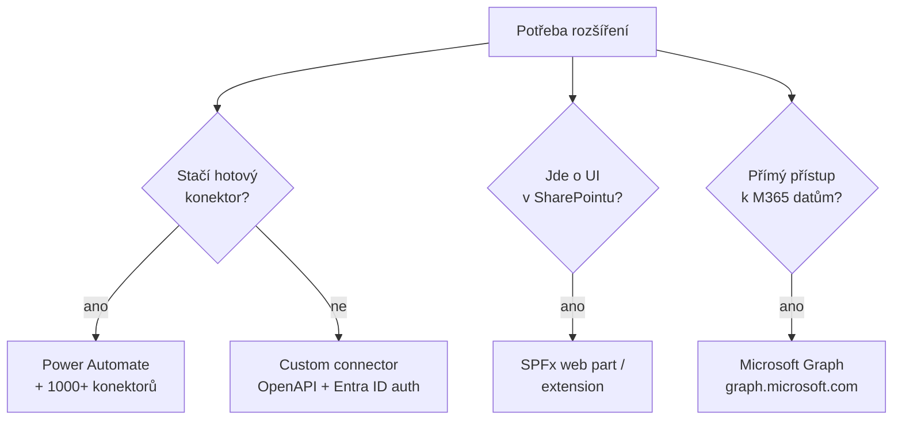

# M · Pro-code vs. low-code agenti a vzory rozšíření

> Typ: povinný · Den: 3 (závěr) · Odhad: PM blok
> Prostředí: viz [`../../environment.md`](../../environment.md) · Názvosloví: [`../../GLOSSARY.md`](../../GLOSSARY.md)

## Cíle

- Student umí vybrat vrstvu rozšíření: konektor / Power Automate / SPFx / Graph — podle limitů, bezpečnosti a udržovatelnosti.
- Student zná aktuální dev nástroje (Agents Toolkit, Agents SDK) a ví, co je deprecated.
- Student navrhne rozšíření existujícího flow o vlastní akci (lab).

## Výklad

### Mapa možností

- **SPFx** — client-side model pro SharePoint/Teams/Viva Connections (tam jediná cesta); **add-in model je deprecated, SPFx je náhrada** ([SPFx overview](https://learn.microsoft.com/en-us/sharepoint/dev/spfx/sharepoint-framework-overview)).
- **Microsoft Graph** — jeden endpoint `graph.microsoft.com` pro M365 data; SharePoint zdroje site/list/listItem/driveItem, weby jen read (list/item read-write) ([Graph overview](https://learn.microsoft.com/en-us/graph/overview), [SharePoint API](https://learn.microsoft.com/en-us/graph/api/resources/sharepoint)). Pozor rename: Graph connectors = **Microsoft 365 Copilot connectors**.
- **Custom connectors** — obal nad REST API (OpenAPI definice; auth doporučeně Entra ID); sdílené mezi Power Automate, Power Apps **a Copilot Studio** (ne Logic Apps) ([Custom connectors](https://learn.microsoft.com/en-us/connectors/custom-connectors/)).
- **Microsoft 365 Agents Toolkit** — nástupce Teams Toolkitu (VS Code, JS/TS/Python); staví deklarativní i custom engine agenty. **TeamsFx SDK je deprecated** — nová práce jede na **Microsoft 365 Agents SDK** ([Agents Toolkit](https://learn.microsoft.com/en-us/microsoftteams/platform/toolkit/agents-toolkit-fundamentals)).

### Rozhodovací osa (limity · bezpečnost · udržovatelnost)

| Kritérium | Low-code (flow + konektory) | Pro-code (SPFx / Graph / Agents SDK) |
|---|---|---|
| Rychlost dodání | hodiny–dny | dny–týdny |
| Limity | throttling konektorů, AI Builder kredity, licence per-user | limity API (Graph throttling), jinak volné |
| Bezpečnost | DLP politiky konektorů, Entra ID auth | plná kontrola (app registration, scopes, cert auth) |
| Udržovatelnost | flow žije v prostředí, ALM přes solutions | **kód v repu, code review, CI/CD** |
| Kdo udrží | power user / IT | vývojář |

## Klíčové rozlišení

- **Kupovat konektor vs. psát kód**: custom connector je nejmenší pro-code krok — API kontrakt bez vlastní aplikace. SPFx/Graph až když potřebuješ UI nebo přístup mimo možnosti konektorů.
- **Deklarativní agent vs. custom engine**: deklarativní = instrukce + knowledge na orchestrátoru Copilotu (repo-as-code, D5); custom engine = vlastní hosting a modely. Pro 90 % scénářů kurzu stačí deklarativní.
- **Deprecated vrstvy neučit**: SharePoint add-in model, TeamsFx SDK, staré „in a folder" triggery.

## Naše prostředí

- Lab je **simulace** — návrh rozšíření demo flow z bloku 3, bez psaní kódu. Dev nástroje se ukazují, neinstalují.

## Lab

Viz [`lab-flow-extension.md`](lab-flow-extension.md) — rozšíření flow o vlastní akci (simulace).

## Zdroje (Microsoft)

[SharePoint Framework overview](https://learn.microsoft.com/en-us/sharepoint/dev/spfx/sharepoint-framework-overview) · [Microsoft Graph overview](https://learn.microsoft.com/en-us/graph/overview) · [SharePoint API v Graphu](https://learn.microsoft.com/en-us/graph/api/resources/sharepoint) · [Microsoft 365 Agents Toolkit](https://learn.microsoft.com/en-us/microsoftteams/platform/toolkit/agents-toolkit-fundamentals) · [Custom connectors](https://learn.microsoft.com/en-us/connectors/custom-connectors/)

## Stav produktu / delta

> [!WARNING] Ověřit k datu běhu — stav k 2026-07.
> TeamsFx SDK má community support jen do září 2026 — po tomto datu úplně vyřadit z výkladu. Agents Toolkit v GCC: alpha; GCC High/DoD roadmap. Copilot connectors (ex-Graph connectors) — hlídat další posuny názvů.
