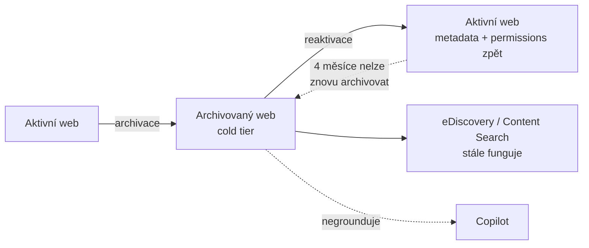

# M · Microsoft 365 Archive

> Typ: povinný · Den: 4 · Odhad: kratší AM/PM blok
> Prostředí: viz [`../../environment.md`](../../environment.md) · Názvosloví: [`../../GLOSSARY.md`](../../GLOSSARY.md)

## Cíle

- Student umí navrhnout strategii „studených" dat: co archivovat, co to udělá s přístupem a náklady.
- Student zná souhru archivu s retencí, eDiscovery a Copilotem.
- Student spočítá, kdy je archiv zadarmo a kdy se platí.

## Výklad

### Co Archive dělá

**Microsoft 365 Archive** = cold storage pro **neaktivní SharePoint weby** (site-level GA; **file-level v preview**); OneDrive jen pro **nelicencované** účty ([Archive overview](https://learn.microsoft.com/en-us/microsoft-365/archive/archive-overview)).

Archivovaný obsah:

- **není** přímo přístupný uživatelům,
- **je** plně prohledatelný pro **Purview Content Search / eDiscovery** (compliance nekončí archivací),
- **Copilot nad ním negrounduje** — archivace je i nástroj AI hygieny (stará data nepletou odpovědi),
- reaktivace vrací web **beze ztráty** metadat a permissions.

### Náklady

- **$0.05/GB/měsíc**, ale účtuje se **jen nad rámec licencované SharePoint kvóty tenantu** — dokud se (aktivní + archivované) vejde do kvóty, archiv je zdarma ([Archive pricing](https://learn.microsoft.com/en-us/microsoft-365/archive/archive-pricing)).
- **Reaktivační poplatek pro SharePoint zrušen (31. 3. 2025)**; reaktivovaný web nejde 4 měsíce znovu archivovat. Výjimka: nelicencované OneDrivy reaktivaci platí per GB.
- Vypnutí billingu: obsah zůstává archivovaný a reaktivovatelný, ale počítá se jako aktivní storage.

### Setup

Azure subscription + PAYG → Org settings → **Pay-as-you-go services → Archive** → weby se archivují ze **SharePoint admin centra** (SharePoint/Global Admin) ([Setup](https://learn.microsoft.com/en-us/microsoft-365/archive/archive-setup)). Přirozený vstup: inactive site policy ze SAM (D3) najde kandidáty, Archive je uklidí.

## Klíčové rozlišení

- **Archive vs. Backup**: archiv = levnější *místo* pro živá, ale nepoužívaná data (stále jediná kopie!); backup = *druhá kopie* pro obnovu. Archivovaný web pořád chceš mít v backup policy.
- **Archive vs. retence**: retence rozhoduje, *kdy smí obsah zaniknout*; archiv rozhoduje, *kolik stojí jeho skladování*. Retenční politiky platí i v archivu.
- **Archivace jako AI governance**: RCD (D3) skrývá web před Copilotem, archiv ho skryje taky — ale navíc zlevní. Pro mrtvé weby je archiv čistší řešení.

## Naše prostředí

- Archivace/reaktivace = **instruktorské demo** (SharePoint admin centrum). Studenti navrhují archivační plán (lab).

## Lab

Viz [`lab-archive-plan.md`](lab-archive-plan.md) — plán archivace pro kolekci webů.

## Zdroje (Microsoft)

[Microsoft 365 Archive overview](https://learn.microsoft.com/en-us/microsoft-365/archive/archive-overview) · [Pricing](https://learn.microsoft.com/en-us/microsoft-365/archive/archive-pricing) · [Setup](https://learn.microsoft.com/en-us/microsoft-365/archive/archive-setup)

## Stav produktu / delta

> [!WARNING] Ověřit k datu běhu — stav k 2026-07.
> File-level archive = preview (omezené app kompatibility: Word/PPT online, mobil, macOS sync). Cena $0.05/GB/měs a pravidlo „zdarma do kvóty" ověřit proti pricing stránce. Copilot negrounduje archiv — chování ověřit při GA file-level archivu.
