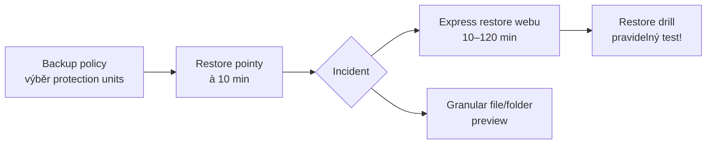

# M · Microsoft 365 Backup

> Typ: povinný · Den: 4 (otvírák) · Odhad: AM blok
> Prostředí: viz [`../../environment.md`](../../environment.md) · Názvosloví: [`../../GLOSSARY.md`](../../GLOSSARY.md)

## Cíle

- Student zná rozsah M365 Backup (SharePoint + OneDrive + Exchange) a jeho RPO/RTO čísla.
- Student umí navrhnout plán obnovy s testovací kadencí.
- Student ví, jak se Backup platí a proč nekoliduje s retencí.

## Výklad

### Co chrání a kde data žijí

**Microsoft 365 Backup** (GA) zálohuje **SharePoint weby, OneDrive účty a Exchange mailboxy** — zálohy zůstávají **uvnitř M365 trust boundary** a respektují data residency; do Azure odchází jen billing metadata ([Backup overview](https://learn.microsoft.com/en-us/microsoft-365/backup/backup-overview)). Datová suverenita drží.

### RPO / RTO

| Parametr | SharePoint / OneDrive | Exchange |
|---|---|---|
| Restore pointy | à 10 min po dobu 2 týdnů, pak týdenní do 52 týdnů | à 10 min po celých 52 týdnů |
| Retence záloh | 1 rok | 1 rok |
| RTO | 1–3 TB/h; express restore webu 10–120 min | ~200–500 položek/min |

- Granularita: rollback celého webu/OneDrivu; Exchange item-level; **granular file/folder restore = public preview** (od 12/2025); obnova verzí souborů „coming soon".
- Úložiště je **append-only**; offboarding má 90denní ochrannou lhůtu s notifikacemi adminům.

### Setup a role

Azure subscription + PAYG billing (nově v **Billing node** admin centra) → Settings → Microsoft 365 Backup → backup policies ([Setup](https://learn.microsoft.com/en-us/microsoft-365/backup/backup-setup)). Zapíná SharePoint/Global Admin; provoz zvládne vyhrazená role **Microsoft 365 Backup Administrator** (všechny 3 workloady) — least privilege v praxi.

### Cena

**$0.15/GB/měsíc chráněného obsahu; obnovy zdarma** ([Pricing](https://learn.microsoft.com/en-us/microsoft-365/backup/backup-pricing)). Účtovaná velikost = živý obsah (vč. 1. koše, archivu mailboxu) + smazaná/verzovaná data držená pro obnovu. Kalkulačka: aka.ms/M365BackupCalculator.

## Klíčové rozlišení

- **Backup vs. retence (Purview)**: retence řídí *životní cyklus obsahu* (compliance); backup řídí *obnovitelnost* (provoz). Purview politiky **neovlivňují** retenci záloh — jsou to nezávislé systémy.
- **Backup vs. koš/verze**: koš a verzování chrání před drobnými chybami; backup před hromadnou ztrátou (ransomware, škodlivý skript) — 10min pointy a append-only úložiště jsou na scénář, kdy je koš taky pryč.
- **Plán bez drilu není plán**: RTO čísla platí, jen když obnovu někdo pravidelně zkouší — proto lab končí testovací kadencí.

## Naše prostředí

- Zapnutí a restore = **instruktorské demo** (tenant-wide, PAYG). Studenti dělají posture review a restore plán (lab).

## Lab

Viz [`lab-backup-restore.md`](lab-backup-restore.md) — backup posture review & restore drill.

## Zdroje (Microsoft)

[Microsoft 365 Backup overview](https://learn.microsoft.com/en-us/microsoft-365/backup/backup-overview) · [Setup](https://learn.microsoft.com/en-us/microsoft-365/backup/backup-setup) · [Pricing](https://learn.microsoft.com/en-us/microsoft-365/backup/backup-pricing)

## Stav produktu / delta

> [!WARNING] Ověřit k datu běhu — stav k 2026-07.
> Granular file/folder restore je public preview; file-version restore „coming soon" — ověřit stav. Billing setup se stěhuje ze Setup node do Billing node (migrace běží). Cena $0.15/GB/měs — ověřit proti pricing stránce.
