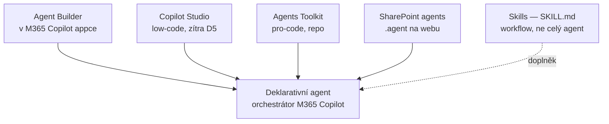

# M · Copilot Agents — cesty tvorby agentů

> Typ: povinný · Den: 4 (závěr dne — přesun z D5) · Odhad: poslední PM blok — vč. živého dema Agent Builderu
> Prostředí: viz [`../../environment.md`](../../environment.md) · Názvosloví: [`../../GLOSSARY.md`](../../GLOSSARY.md)

## Cíle

- Student zná **všechny cesty tvorby agentů** a umí vybrat podle scénáře a publika.
- Student viděl živě stavbu agenta v **Agent Builderu**.
- Student navrhne agenta včetně **plánu vyhodnocení** (lab) — návrat pojmů z D2 (Agent Instructions!).

## Výklad

### Deklarativní agent — společný základ

Deklarativní agent = **instrukce + knowledge + akce** běžící na stejném orchestrátoru a modelech jako Microsoft 365 Copilot — žádný vlastní hosting; dědí ochrany dat Copilotu a prochází RAI validací ([Declarative agents overview](https://learn.microsoft.com/en-us/microsoft-365/copilot/extensibility/overview-declarative-agent)). Anatomie instrukcí = D2 prompting-fundamentals (purpose → guidelines → skills, 8 000 znaků, XPIA).

### Mapa cest tvorby

| Cesta | Pro koho | Tvorba vyžaduje | Distribuce |
|---|---|---|---|
| **Agent Builder** | koncový uživatel | M365 Copilot licence, **nebo tenant s PAYG pro Copilot Studio** ([Agent Builder](https://learn.microsoft.com/en-us/microsoft-365/copilot/extensibility/agent-builder)) | sdílení + org katalog; **ne marketplace** |
| **Copilot Studio** | maker / power user | Copilot Studio přístup (kredity/PAYG) | org katalog přes schválení, marketplace |
| **Agents Toolkit** | vývojář | zdarma (VS Code); repo-as-code | org katalog, marketplace |
| **SharePoint agents** | vlastník obsahu | **tvorba: Copilot licence**; použití: licence NEBO PAYG ([SharePoint agents](https://learn.microsoft.com/en-us/sharepoint/get-started-sharepoint-agents)) | jen web (sdílení do Teams chatu) |
| **Skills** (preview) | uživatel webu | web s Copilot in SharePoint (**= Copilot licence, PAYG nestačí**) + Edit; `SKILL.md` v Agent Assets ([Skills](https://learn.microsoft.com/en-us/sharepoint/copilot-in-sharepoint-skills)) — hloubkově zítra v [`../../day-5/skills/`](../../day-5/skills/) | v rámci webu |

Detailní **srovnání schopností** cest (knowledge vč. listů, akce, orchestrace, ALM, governance) + rozhodovací osa: [`comparison-agent-paths.md`](comparison-agent-paths.md).

### Agent Builder — demo v bloku

Lightweight tvorba přímo v M365 Copilot (web/Teams desktop; ne mobil): popis → instrukce → knowledge → publikace. Backend je Copilot Studio. Demo: agent „Průvodce kurzem" nad materiály na webu instruktora.

### Distribuce a governance — návaznost na copilot-admin

Org flow: maker publikuje → **Requests** v admin centru → admin Publish/Reject → „Built by your org" v **Agent Store** ([Agent Store](https://learn.microsoft.com/en-us/microsoft-365/copilot/copilot-agent-store), [Publish options](https://learn.microsoft.com/en-us/microsoft-365/copilot/extensibility/publish)). Registr, blokaci a Agent 365 proberete hned zítra ráno v `copilot-admin` (D5).

## Klíčové rozlišení

- **Agent vs. Skill**: Skill = uložený vícekrokový postup uvnitř Copilot in SharePoint (neumí externí systémy, nepřekročí práva uživatele); agent = samostatná persona s instrukcemi, knowledge a případně akcemi.
- **Tvorba vs. použití** (licenčně!): u SharePoint agentů PAYG uživatel agenta *použije*, ale k *tvorbě* potřebuje Copilot licenci. Stejný vzor „licence gate-uje funkci, permissions gate-ují obsah" z D1.
- **Kde se rozhoduje o kvalitě**: instrukce + popis (generative orchestration vybírá podle popisů — další blok). Proto lab vyžaduje evaluační plán, ne jen nápad.

## Naše prostředí

- **D4 = tři cesty:** Agent Builder (**studenti hands-on**), SharePoint agent (**instruktor jen ukáže** — tvorba je license-only), Agents Toolkit (**studenti hands-on, společně**). **Copilot Studio je celé až D5** (analytický payoff nad týmiž daty). **Skills** taky D5 (license-only, ověřeno 2026-07). Go/no-go: dostupnost Agent Builderu v PAYG ověřit před během.

## Lab

- [`lab-agent-design.md`](lab-agent-design.md) — návrh agenta a plán vyhodnocení (všichni, psací).
- [`lab-hr-agent-build.md`](lab-hr-agent-build.md) — HR Asistent: **Agent Builder** (studenti) + **SharePoint agent** (instruktor ukáže).
- [`lab-toolkit-agent.md`](lab-toolkit-agent.md) — první agent v **Agents Toolkitu** (studenti, společně) jako spravovaná konfigurace nad knihovnou `Runbooky` (bez akce, jen M365).

Dva running examples (každý nástroj na své práci):

- [`scenario-hr-agent.md`](scenario-hr-agent.md) — číst list + soubory → Agent Builder / SharePoint agent (analytika → Copilot Studio v D5).
- [`scenario-support-agent.md`](scenario-support-agent.md) — čtení runbooků, agent jako **spravovaná konfigurace** (bez akce, jen M365) → Agents Toolkit.

Instruktorský demo playbook (tři cesty naživo, „nástroj na svou práci"): [`guide-agent-build-demo.md`](guide-agent-build-demo.md).

## Zdroje (Microsoft)

[Declarative agents overview](https://learn.microsoft.com/en-us/microsoft-365/copilot/extensibility/overview-declarative-agent) · [Agent Builder](https://learn.microsoft.com/en-us/microsoft-365/copilot/extensibility/agent-builder) · [SharePoint agents](https://learn.microsoft.com/en-us/sharepoint/get-started-sharepoint-agents) · [Skills in Copilot in SharePoint](https://learn.microsoft.com/en-us/sharepoint/copilot-in-sharepoint-skills) · [Agent Store](https://learn.microsoft.com/en-us/microsoft-365/copilot/copilot-agent-store) · [Publish options](https://learn.microsoft.com/en-us/microsoft-365/copilot/extensibility/publish)

## Stav produktu / delta

> [!WARNING] Ověřit k datu běhu — stav k 2026-07.
> Skills = preview (Copilot in SharePoint preview). Licenční matice tvorba/použití u SharePoint agentů se může při GA měnit — ověřit tabulku na get-started stránce. Agent Builder dostupnost v PAYG tenantu ověřit živě před během (go/no-go labu).
