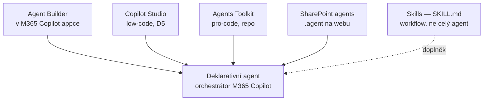

# M · Agenti — mapa cest tvorby (úvod)

> Typ: povinný · Den: 4 (úvod k agentním blokům) · Odhad: krátký blok — výklad + srovnání + návrhový lab
> Prostředí: viz [`../../environment.md`](../../environment.md) · Názvosloví: [`../../GLOSSARY.md`](../../GLOSSARY.md)

Úvodní blok před třemi nástrojovými: [`../agent-builder/`](../agent-builder/README.md) · [`../sharepoint-agents/`](../sharepoint-agents/README.md) · [`../agents-toolkit/`](../agents-toolkit/README.md). Tady se učí **společný základ** (deklarativní agent, mapa cest, srovnání) a navrhne se agent včetně **plánu vyhodnocení**.

## Cíle

- Student zná **všechny cesty tvorby agentů** a umí vybrat podle scénáře a publika.
- Student rozumí **deklarativnímu agentovi** (instrukce + knowledge + akce) — návrat pojmů z D2 (Agent Instructions!).
- Student navrhne agenta včetně **plánu vyhodnocení** (lab), použitelného v následujících nástrojových blocích.

## Výklad

### Deklarativní agent — společný základ

Deklarativní agent = **instrukce + knowledge + akce** běžící na stejném orchestrátoru a modelech jako Microsoft 365 Copilot — žádný vlastní hosting; dědí ochrany dat Copilotu a prochází RAI validací ([Declarative agents overview](https://learn.microsoft.com/en-us/microsoft-365/copilot/extensibility/overview-declarative-agent)). Anatomie instrukcí = D2 prompting-fundamentals (purpose → guidelines → skills, 8 000 znaků, XPIA).

### Mapa cest tvorby

| Cesta | Pro koho | Tvorba vyžaduje | Distribuce |
|---|---|---|---|
| **[Agent Builder](../agent-builder/README.md)** | koncový uživatel | M365 Copilot licence, **nebo** tenant s PAYG pro Copilot Studio | sdílení + org katalog; **ne marketplace** |
| **[SharePoint agents](../sharepoint-agents/README.md)** | vlastník obsahu | **tvorba: Copilot licence**; použití: licence NEBO PAYG | jen web (sdílení do Teams chatu) |
| **[Agents Toolkit](../agents-toolkit/README.md)** | vývojář (u nás: správce, jako konfigurace) | zdarma (VS Code); repo-as-code | org katalog, marketplace |
| **Copilot Studio** (D5) | maker / power user | Copilot Studio přístup (kredity/PAYG) | org katalog přes schválení, marketplace |
| **Skills** (D5, preview) | uživatel webu | web s Copilot in SharePoint (**= Copilot licence, PAYG nestačí**) + Edit | v rámci webu |

Detailní **srovnání schopností** (knowledge vč. listů, akce, orchestrace, ALM, governance) + rozhodovací osa: [`comparison-agent-paths.md`](comparison-agent-paths.md).

### Distribuce a governance — návaznost na copilot-admin

Org flow: maker publikuje → **Requests** v admin centru → admin Publish/Reject → „Built by your org" v **Agent Store** ([Agent Store](https://learn.microsoft.com/en-us/microsoft-365/copilot/copilot-agent-store), [Publish options](https://learn.microsoft.com/en-us/microsoft-365/copilot/extensibility/publish)). Registr, blokaci a Agent 365 proberete hned zítra ráno v `copilot-admin` (D5).

## Klíčové rozlišení

- **Agent vs. Skill**: Skill = uložený vícekrokový postup uvnitř Copilot in SharePoint (neumí externí systémy, nepřekročí práva uživatele); agent = samostatná persona s instrukcemi, knowledge a případně akcemi.
- **Tvorba vs. použití** (licenčně!): u SharePoint agentů PAYG uživatel agenta *použije*, ale k *tvorbě* potřebuje Copilot licenci. Vzor „licence gate-uje funkci, permissions gate-ují obsah" z D1.
- **Kde se rozhoduje o kvalitě**: instrukce + popis (generative orchestration vybírá podle popisů). Proto lab vyžaduje evaluační plán, ne jen nápad.

## Naše prostředí — čtyři agentní bloky D4

1. **Agenti — mapa cest** (tento blok): výklad + srovnání + návrhový lab.
2. **[Agent Builder](../agent-builder/README.md)** — studenti hands-on (HR Asistent).
3. **[SharePoint agents](../sharepoint-agents/README.md)** — instruktor ukáže (limit 1 zdroj; tvorba license-only).
4. **[Agents Toolkit](../agents-toolkit/README.md)** — studenti společně (agent jako spravovaná konfigurace).

**Copilot Studio i Skills jsou až D5.**

## Lab a sdílené materiály

- [`lab-agent-design.md`](lab-agent-design.md) — návrh agenta a plán vyhodnocení (všichni, psací); použije se v nástrojových blocích.
- Running examples: [`scenario-hr-agent.md`](scenario-hr-agent.md) (data/list → Agent Builder + SharePoint agent) · [`scenario-support-agent.md`](scenario-support-agent.md) (runbooky → Agents Toolkit).
- Instruktorský demo playbook (všechny cesty naživo): [`guide-agent-build-demo.md`](guide-agent-build-demo.md).

## Zdroje (Microsoft)

[Declarative agents overview](https://learn.microsoft.com/en-us/microsoft-365/copilot/extensibility/overview-declarative-agent) · [Agent Store](https://learn.microsoft.com/en-us/microsoft-365/copilot/copilot-agent-store) · [Publish options](https://learn.microsoft.com/en-us/microsoft-365/copilot/extensibility/publish)

## Stav produktu / delta

> [!WARNING] Ověřit k datu běhu — stav k 2026-07.
> Dostupnost Agent Builderu v PAYG tenantu ověřit před během (go/no-go). SharePoint agents podpora listů = GA ~05/2026 (docs lag). Skills = preview, license-only.
