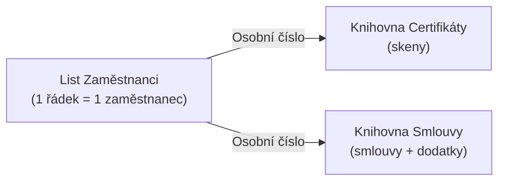

# Scénář · HR Asistent — agent nad daty zaměstnanců

> Modul: copilot-agents · Typ: referenční scénář pro lab (D4) + running example do D5
> Prostředí: viz [`../../environment.md`](../../environment.md) · Názvosloví: [`../../GLOSSARY.md`](../../GLOSSARY.md)

Průběžný scénář, na kterém stavíme agenta **třemi cestami** a ukazujeme, proč se cesty liší. Data provisionuje instruktor skriptem `scripts/New-HRAgentData.ps1` na HR web.

> [!IMPORTANT] Jen fiktivní data
> Všechna jména a osobní čísla jsou vymyšlená. Do kurzovního tenantu se **nikdy** nenahrávají reálná personální data (GDPR / ISO 27001). Datová suverenita: data zůstávají v tenantu, agent nikdy nepřekročí práva uživatele.

## Persona a účel

**HR Asistent** pomáhá HR referentovi držet přehled o zaměstnancích:

- *„Komu propadá certifikát do 30 dnů?"* (chybějící / expirující certifikace)
- *„Kdo nemá podepsaný dodatek?"* (dokumenty k podpisu)
- *„Komu končí zkušební doba tento měsíc?"*
- *„Ukaž mi údaje a manažera osobního čísla 10018."*
- *„Najdi podepsanou pracovní smlouvu pro osobní číslo 10024."*

Není to agent pro řadové zaměstnance — je to nástroj HR. To je i test hranice práv (viz lab).

## Datový model

Klíč celého scénáře je **osobní číslo** — spojuje záznam v listu se soubory v knihovnách.



### List `Zaměstnanci`

Sloupce záměrně **zrcadlí atributy uživatele v Entra ID** — do budoucna se list dá plnit synchronizací z Entra/Graphu, takže „stejná data jako v Entra ID" není náhoda.

| Sloupec | Typ | Odpovídá Entra ID | K čemu agentovi |
| --- | --- | --- | --- |
| Osobní číslo | Číslo | `employeeId` | **klíč** na knihovny |
| Zaměstnanec (Title) | Text | `displayName` | identita |
| Jméno / Příjmení | Text | `givenName` / `surname` | vyhledání |
| UPN / e-mail | Text | `userPrincipalName` | kontakt |
| Útvar | Volba | `department` | filtr |
| Pozice | Text | `jobTitle` | kontext |
| Manažer | Text | `manager` | eskalace |
| Lokalita | Volba | `officeLocation` | filtr |
| Typ úvazku | Volba | `employeeType` | HPP/DPČ… |
| Nástup | Datum | `employeeHireDate` | výpočet zkušebky |
| Konec PP | Datum | `employeeLeaveDateTime` | offboarding |
| Účet aktivní | Ano/Ne | `accountEnabled` | stav účtu |
| Zkušební doba do | Datum | — | „končí zkušebka" |
| Vyžadované certifikace | Volba (více) | — | co má mít |
| Certifikace platí do | Datum | — | „propadá certifikát" |
| Typ smlouvy | Volba | — | kontext |
| Dokument k podpisu | Ano/Ne | — | „nepodepsáno" |
| Podepsáno dne | Datum | — | audit |
| Stav | Volba | — | Onboarding/Aktivní/Výpověď/Offboarding |

### Knihovny (propojené osobním číslem)

| Knihovna | Obsah | Klíčová metadata |
| --- | --- | --- |
| `Certifikáty` | skeny certifikátů | Osobní číslo, Název certifikace, Vydáno, **Platí do**, Vydavatel |
| `Smlouvy` | PP smlouvy, dodatky, NDA, GDPR, mzdové výměry | Osobní číslo, Typ dokumentu, Platí od/do, **Stav podpisu**, Podepsáno dne |

## Zásadní omezení: agent nedělá JOIN

> [!WARNING] Poctivé očekávání
> Deklarativní agent **negrounduje relačně** — neumí „vezmi řádky z listu a spáruj se soubory v knihovně". Osobní číslo je (a) **metadatová disciplína** pro lidi a flow, (b) **hledatelný token**, na který agent matchuje.

Co z toho plyne pro typy dotazů:

| Dotaz | Co reálně potřebuje | Kdo to umí |
| --- | --- | --- |
| „Údaje osobního čísla 10018" | lookup v listu | každá cesta s listem |
| „Najdi podepsanou NDA pro 10024" | hledání v knihovně (obsah + metadata) | Agent Builder / SharePoint agent / Toolkit |
| „Komu propadá certifikát do 30 dnů" | **analytický/filtr dotaz nad listem** | **jen Copilot Studio** |
| „Kdo nepodepsal dodatek" | filtr nad listem (Dokument k podpisu = Ano) | Copilot Studio (nebo Power Automate) |
| „Vyjmenuj lidi z listu bez souboru v knihovně" | **relační JOIN list × knihovna** | žádná deklarativní cesta → **Power Automate** |

## Proč tři cesty dopadnou různě (jádro labu)

Tentýž požadavek narazí u každé cesty na jinou hranu — přesně proto je to dobrý výukový scénář (srovnávací matice: [`comparison-agent-paths.md`](comparison-agent-paths.md)).

- **Agent Builder** (lehká tvorba pro koncového uživatele přímo v Copilot appce) — knowledge = list `Zaměstnanci` (1 list) + obě knihovny (soubory ≤ 100). Zvládne **lookup a hledání v souborech**. Strop: **žádná analytika** („komu propadá certifikát" jen prioritizuje, nespočítá).
- **SharePoint agent** — tvrdé omezení **1 zdroj a nic jiného** (přidání dalšího shodí ostatní; MC1255409). HR scénář (list + 2 knihovny) se do **jednoho** SharePoint agenta nevejde → buď scopovat na jeden zdroj (např. jen knihovna `Smlouvy`), nebo víc agentů. Omezení učí samo sebe.
- **Microsoft 365 Agents Toolkit** (pro-code, VS Code / Visual Studio) — SharePoint knowledge v manifestu = **weby / knihovny / složky / soubory** (`list_id` = **knihovna**, `unique_id` = soubor/složka — ověřeno ve schématu 1.7). **Strukturovaný list jako tabulku manifest nezná vůbec** — tabulková data jen přes `Dataverse` / Copilot konektor / akci. Pro HR list je tedy Toolkit špatný nástroj; jeho vlastní scénář, kde vyhrává (akce + agent jako kód), je [`scenario-support-agent.md`](scenario-support-agent.md).
- **(dozraje v D5) Copilot Studio** — jediná cesta na **analytické dotazy** nad listem (až 10 listů). Zde scénář vrcholí: „komu propadá certifikát do 30 dnů" a „kdo nepodepsal" jsou přesně dotazy pro Studio.

## Ukázková data (edge cases)

Skript nasází 20 zaměstnanců (namapovaných na `user.11`–`user.30`, každý student „vlastní" jeden záznam) se záměrně zamíchanými stavy, aby evaluační dotazy měly co vracet:

- **3 certifikáty propadající do 30 dnů** (os. č. 10018, 10022, 10027) + **2 propadlé** (10016, 10024)
- **4 nepodepsané dodatky** (10017, 10019, 10025, 10029)
- **2 zkušební doby končící brzy** (10026, 10030)
- **1 offboarding** (10028), **1 výpověď** (10023)

Datumy se počítají jako **offsety vůči `-ReferenceDate`** (default dnešek), takže „do 30 dnů" platí při každém běhu. Instruktor může datum pinnout pro reprodukovatelné demo.

## Provisioning

```powershell
# instruktor, jednorázově; ClientId = app PnP-GOC224 (nikdy do repa)
./scripts/New-HRAgentData.ps1 `
  -SiteUrl https://ms365x17157302.sharepoint.com/sites/hr-demo `
  -ClientId <guid> -CreateSite -SiteOwner admin@spdemo.online -UseDeviceCode
```

Idempotentní; opětovné naplnění dat přes `-Reseed`. Detail viz hlavička skriptu.

## Stav produktu / delta

> [!WARNING] Ověřit k datu běhu — stav k 2026-07.
> Podpora listů se hýbe nejrychleji (SharePoint agents GA ~05/2026, MC1255409; docs lag). Copilot Studio listy = production-ready preview s analytikou. Manifest schema 1.8 (listy pro Toolkit) k 2026-07 neexistuje — Toolkit tedy list `Zaměstnanci` stále nescopuje. Před během ověřit go/no-go dostupnost Agent Builderu a Copilot Studia v PAYG tenantu.
