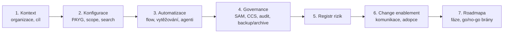

# Závěrečný projekt a další kroky

> Typ: povinný · Den: 5 (závěr) · Odhad: PM blok
> Prostředí: viz [`../../environment.md`](../../environment.md) · Názvosloví: [`../../GLOSSARY.md`](../../GLOSSARY.md)

## Cíle

- Student sestaví **rollout blueprint** — design dokument nasazení Copilotu a obsahových služeb pro svou organizaci.
- Student umí blueprint obhájit: konfigurace, automatizace, governance, rizika, change enablement, roadmapa.
- Student odchází s mapou next steps (adopce, zdroje, co ověřit doma).

## Výklad

### Závěrečný projekt = blueprint, ne stavba

Celý týden se stavělo a klikalo; závěrečný projekt skládá kousky do **rozhodovacího dokumentu**, který si student odnáší do své organizace. Formát: MD dokument (samozřejmě), sekce:

Každá sekce má oporu v modulu kurzu — blueprint je rekapitulace týdne v jazyce vlastní firmy.

### Registr rizik — minimum

Formát: riziko → dopad → pravděpodobnost → mitigace (nástroj z kurzu!) → vlastník. Povinné kategorie: oversharing (D3), náklady PAYG (D1/D2), ztráta dat (D4), nekontrolovaní agenti (D5), adopční selhání (change).

### Next steps — kam po kurzu

- **Copilot Success Kit** — implementační průvodce (leaders, user enablement, technical readiness, scénáře) ([Success Kit](https://adoption.microsoft.com/en-us/copilot/success-kit/)); samostatný agents success kit.
- **Enablement guide** na Learn: 5 kroků org readiness → licence → apps/network → setup → welcome & feedback ([Enablement resources](https://learn.microsoft.com/en-us/microsoft-365/copilot/microsoft-365-copilot-enablement-resources)).
- **Adoption hub**: Champion Playbook, Prompt Gallery ([adoption.microsoft.com/copilot](https://adoption.microsoft.com/en-us/copilot/)).

## Klíčové rozlišení

- **Blueprint vs. runbook**: runbook (D5) říká *co dělat, když hoří*; blueprint říká *co postavit, aby nehořelo*. Runbook je jedna sekce blueprintu (governance/provoz).
- **Roadmapa s branami**: každá fáze má go/no-go kritérium (např. „DAG report bez kritických nálezů → pustit Copilot na další weby") — přesně jak jel celý kurz.

## Naše prostředí

- Blueprint se píše pro **vlastní organizaci studenta** (ne pro kurzovní tenant) — kurzovní tenant sloužil jako důkaz proveditelnosti.

## Lab

Viz [`lab-capstone-blueprint.md`](lab-capstone-blueprint.md) — rollout blueprint. Hodnoticí rubrika: instructor-notes.

## Zdroje (Microsoft)

[Copilot Success Kit](https://adoption.microsoft.com/en-us/copilot/success-kit/) · [Copilot enablement resources](https://learn.microsoft.com/en-us/microsoft-365/copilot/microsoft-365-copilot-enablement-resources) · [Copilot adoption hub](https://adoption.microsoft.com/en-us/copilot/)

## Stav produktu / delta

> [!WARNING] Ověřit k datu běhu — stav k 2026-07.
> Success Kit se aktualizuje průběžně (naposledy 2/2026, česky není) — před během zkontrolovat obsah balíčku. Odkazy na preview funkce v blueprintech studentů označovat markerem „ověřit při realizaci".
