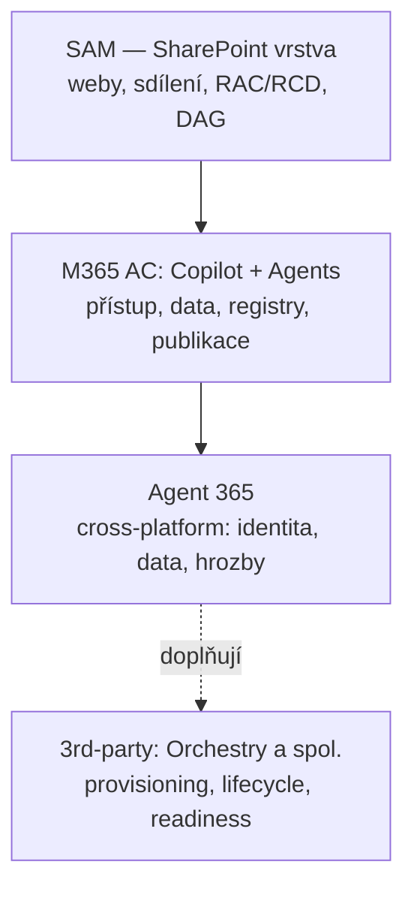

# M · Nástroje pro správu Copilotu a agentů

> Typ: povinný · Den: 5 (otvírák — správa agentů postavených v D4) · Odhad: AM blok — jádro nitě „nástroje pro správu"
> Prostředí: viz [`../../environment.md`](../../environment.md) · Názvosloví: [`../../GLOSSARY.md`](../../GLOSSARY.md)

## Cíle

- Student se orientuje v **sekci Copilot** (Copilot Control System) a **sekci Agents** M365 admin centra.
- Student ví, co přidává **Agent 365** a kdy sáhnout po 3rd-party nástroji.
- Student umí mapu vrstev správy: SAM × admin centrum × Agent 365 × 3rd-party.

## Výklad

### 1. Sekce Copilot — Copilot Control System (CCS)

M365 admin center → **Copilot → Settings** ([Copilot page](https://learn.microsoft.com/en-us/microsoft-365/copilot/microsoft-365-copilot-page)):

- **User access** — kdo má Copilot (licence, self-service nákupy).
- **Data access** — připojená data, agenti, web grounding.
- **Copilot actions** a **Other settings** — PAYG billing, Frontier preview program, **AI providers operating as Microsoft subprocessors** (modely třetích stran — Anthropic). Datová suverenita / EU Data Boundary / subprocesor vs. nezávislý procesor: [`explainer-ai-subprocessors.md`](explainer-ai-subprocessors.md).
- **Role model:** spravuje **AI Administrator**, čte **Global Reader** — Global Admin na tohle není potřeba (least privilege posun).

### 2. Sekce Agents — Agent Registry

M365 admin center → **Agents** ([Manage agents](https://learn.microsoft.com/en-us/microsoft-365/admin/manage/manage-copilot-agents-integrated-apps)):

- **Registry**: enable/disable/assign/block/remove agentů; typy: org-published, shared-by-creator, Microsoft, partner, **Frontier agents**.
- **Requests**: schvalování publikace agentů do org katalogu (maker → pending → admin Publish/Reject).
- **Overview** dashboard: počty agentů, aktivní uživatelé, **run-time hodiny**, **ownerless agents**, agents at risk ([Agents overview](https://learn.microsoft.com/en-us/microsoft-365/admin/manage/agent-365-overview)).
- Pozor: **Researcher a Analyst** jsou součást core Copilot Chat — agent settings je neřídí.

### 3. Agent 365 — control plane

**Agent 365** = vrstva nad tím vším: observe / govern / secure pro agenty **bez ohledu na platformu vzniku** (Microsoft, open-source, 3rd-party). Propojuje M365 admin center (registry, Agent Map), **Entra** (identita agenta), **Purview** (data), **Defender** (hrozby) ([Agent 365 overview](https://learn.microsoft.com/en-us/microsoft-agent-365/overview)). GA 1. 5. 2026; per-user licence (viz glosář — licencuje se uživatel, ne agent).

### 4. Mapa vrstev — co čím spravuješ

| Otázka | Nástroj |
|---|---|
| Co Copilot *vidí* v SharePointu? | SAM (RCD, RAC, DAG) — D3 |
| Kdo má Copilot a jaká data mu tečou? | CCS (Copilot → Settings) |
| Které agenty kdo smí používat/publikovat? | Agents Registry |
| Identita, bezpečnost a audit agentů napříč platformami? | Agent 365 |
| Provisioning, lifecycle, readiness score? | 3rd-party (viz [`opt-orchestry`](../opt-orchestry/README.md)) |

### Observabilita použití

**Reports → Usage → Microsoft 365 Copilot**: enabled/active users, prompty, adopce po aplikacích, **agent adoption**; data do ~72 h, detaily default anonymizované ([Copilot usage report](https://learn.microsoft.com/en-us/microsoft-365/admin/activity-reports/microsoft-365-copilot-usage)). Pro compliance audit ale platí Purview (další blok) — usage report není auditní stopa.

## Klíčové rozlišení

- **CCS vs. Agent Registry**: Copilot sekce řídí *zážitek a data* Copilotu; Agents sekce řídí *inventář agentů*. Dvě různá místa, často zaměňovaná.
- **Agent 365 vs. Agents sekce**: Registry = M365 agenti; Agent 365 = control plane i pro agenty postavené mimo Microsoft stack (identita v Entra, data v Purview).
- **Usage report ≠ audit log**: usage = adopční metriky (anonymizovatelné, 72h zpoždění); audit = důkazní stopa (Purview, další blok).

## Naše prostředí

- Studenti jako **Global Reader** obě sekce vidí read-only — lab je živá prohlídka. Změny (blokace agenta, publikace) = instruktorské demo.

## Lab

Viz [`lab-copilot-admin-tour.md`](lab-copilot-admin-tour.md) — admin tour: Copilot & Agents.

## Zdroje (Microsoft)

[Microsoft 365 Copilot page (CCS)](https://learn.microsoft.com/en-us/microsoft-365/copilot/microsoft-365-copilot-page) · [Manage Copilot agents](https://learn.microsoft.com/en-us/microsoft-365/admin/manage/manage-copilot-agents-integrated-apps) · [Agents overview / Agent 365 v admin centru](https://learn.microsoft.com/en-us/microsoft-365/admin/manage/agent-365-overview) · [Microsoft Agent 365](https://learn.microsoft.com/en-us/microsoft-agent-365/overview) · [Copilot usage report](https://learn.microsoft.com/en-us/microsoft-365/admin/activity-reports/microsoft-365-copilot-usage)

## Stav produktu / delta

> [!WARNING] Ověřit k datu běhu — stav k 2026-07.
> Tahle oblast se hýbe nejrychleji z celého kurzu: CCS taby, Agents sekce i Agent 365 dashboard se mění po měsících — před během proklikat živý tenant a srovnat se slidy. Agent 365 registry sync s mimo-MS platformami = public preview. Frontier program = preview funkce.
