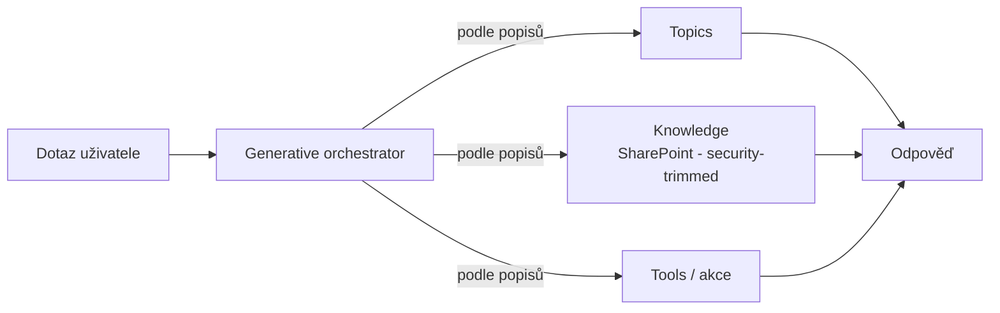

# M · Copilot Studio — stavba nad SharePointem

> Typ: povinný · Den: 5 · Odhad: PM blok
> Prostředí: viz [`../../environment.md`](../../environment.md) · Názvosloví: [`../../GLOSSARY.md`](../../GLOSSARY.md)

## Cíle

- Student postaví základního agenta s **SharePoint knowledge** a rozumí, proč odpovědi respektují práva.
- Student rozliší generative vs. classic orchestraci a ví, čím se řídí výběr topics/tools.
- Student zná bezpečnostní zábrany (DLP) a licenční model (Copilot Credits).

## Výklad

### Nástroj

**Copilot Studio** = grafická low-code stavba **agentů a agent flows**; samostatná appka copilotstudio.microsoft.com ([What is Copilot Studio](https://learn.microsoft.com/en-us/microsoft-copilot-studio/fundamentals-what-is-copilot-studio)). Oproti Agent Builderu (minulý blok): plná kontrola nad topics, akcemi, kanály a publikací.

### SharePoint jako knowledge

- Dvě varianty: plná **SharePoint integrace** (weby + listy, real-time) vs. upload souborů se sync ([SharePoint knowledge](https://learn.microsoft.com/en-us/microsoft-copilot-studio/knowledge-add-sharepoint)).
- **Security-trimmed**: uživatel bez Read práv na zdroj dostane „no response" — hranice práv drží i v agentovi. Sensitivity labels podporované.
- Limity k zapamatování: **Restricted SharePoint Search blokuje SharePoint knowledge úplně**; listy max ~10 na agenta, nad 35 000 řádků degraduje kvalita.

### Orchestrace: generative vs. classic

- **Generative orchestration je default** pro nové agenty: agent vybírá topics/tools/knowledge podle jejich **popisů**, umí zřetězit víc kroků v jednom tahu a doptat se na chybějící vstupy ([Generative orchestration](https://learn.microsoft.com/en-us/microsoft-copilot-studio/advanced-generative-actions)).
- **Classic**: trigger fráze → jeden topic. Předvídatelnější, ale tupější.
- Důsledek pro autory: **kvalita popisů = kvalita routingu** — návrat k D2 (psaní instrukcí a popisů je disciplína, ne detail).

### Bezpečnostní zábrany — DLP

Data policies v **Power Platform admin centru** (konektory Business/Non-business/Blocked); enforcement **povinný pro všechny tenanty od začátku 2025**. Blokovat lze: neautentizovaný chat, typy knowledge (SharePoint, web, dokumenty), HTTP node, konektory-as-tools, publikační kanály ([DLP for Copilot Studio](https://learn.microsoft.com/en-us/microsoft-copilot-studio/admin-data-loss-prevention)). Porušení = Publish tlačítko nejede.

### Licence — Copilot Credits

- Od 1. 9. 2025 je měnou **Copilot Credits** („message packs" jsou mrtvý pojem): balíčky 25 000 kreditů/měsíc (nepřenášejí se), **PAYG přes Azure**, nebo roční prepurchase ([Billing & licensing](https://learn.microsoft.com/en-us/microsoft-copilot-studio/billing-licensing)).
- **Zero-rating**: uživatelé s M365 Copilot licencí nečerpají kredity za classic/generative odpovědi a tenant graph grounding — náš tenant bez licencí platí kreditové sazby za všechno (viz glosář, Copilot Credits PAYG).

## Klíčové rozlišení

- **Copilot Studio vs. Agent Builder**: stejný deklarativní základ; Studio přidává topics, akce/konektory, kanály, ALM — a s tím DLP povinnosti a kreditové účtování. Builder = rychlý osobní agent; Studio = spravovaný firemní agent.
- **Knowledge vs. topic**: knowledge = odkud čerpá fakta (grounding); topic = co má *udělat* (dialog/akce). Nacpat FAQ do topics je anti-pattern — patří do knowledge.
- **Kredity vs. Document processing PAYG**: podruhé a naposledy — dva různé metry (glosář); agent nad SharePointem čerpá **Copilot Credits**.

## Naše prostředí

- Studenti staví agenta nad **vlastním webem** (SharePoint knowledge). Přístup do Copilot Studia přes tenant PAYG — go/no-go instruktora; každý testovací dotaz čerpá kredity (evaluační plán z minulého bloku = 5 testů, ne 50).

## Lab

Viz [`lab-basic-copilot.md`](lab-basic-copilot.md) — postavte základního copilota.

## Zdroje (Microsoft)

[Copilot Studio overview](https://learn.microsoft.com/en-us/microsoft-copilot-studio/fundamentals-what-is-copilot-studio) · [SharePoint knowledge](https://learn.microsoft.com/en-us/microsoft-copilot-studio/knowledge-add-sharepoint) · [Generative orchestration](https://learn.microsoft.com/en-us/microsoft-copilot-studio/advanced-generative-actions) · [Data loss prevention](https://learn.microsoft.com/en-us/microsoft-copilot-studio/admin-data-loss-prevention) · [Billing & licensing](https://learn.microsoft.com/en-us/microsoft-copilot-studio/billing-licensing)

## Stav produktu / delta

> [!WARNING] Ověřit k datu běhu — stav k 2026-07.
> „Workflows" formát flows = public preview. Klasické chatboty v Teams appce skončily (červen 2026) — vše přes web appku. Kreditové sazby a zero-rating tabulku ověřit proti licensing guide (odkaz na billing stránce).
