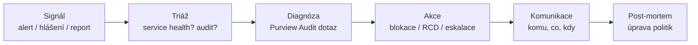

# Provozní monitoring a compliance

> Typ: povinný · Den: 5 · Odhad: AM blok
> Prostředí: viz [`../../environment.md`](../../environment.md) · Názvosloví: [`../../GLOSSARY.md`](../../GLOSSARY.md)

## Cíle

- Student najde auditní stopu Copilot interakce v Purview a ví, co v ní je.
- Student zná zdroje provozního signálu: audit, alerty, service health, usage reporty.
- Student napíše incident runbook (lab) — deliverable modulu.

## Výklad

### Auditní stopa — Purview Audit

- Purview portál → **Audit**; async search joby (přežijí zavřený prohlížeč, drží se 30 dní); PowerShell: `Search-UnifiedAuditLog`. Retence: **180 dní (Audit Standard) / 1 rok (E5, Audit Premium)** ([Audit search](https://learn.microsoft.com/en-us/purview/audit-search)).
- **Copilot eventy se logují automaticky** (Audit Standard, bez konfigurace): RecordType **CopilotInteraction**, AIAppInteraction, ConnectedAIAppInteraction. V záznamu: **AccessedResources** (vč. sensitivity labelů), AgentId/AgentName, `JailbreakDetected`, a `BingWebSearch` prozradí web grounding ([Copilot audit](https://learn.microsoft.com/en-us/purview/audit-copilot)).
- Pozor: audit **ne-Microsoft AI aplikací je PAYG** (per záznam).

### Alerty a zdraví služby

- **Alert policies** žijí v **Microsoft Defender portálu** (Email & collaboration → Policies & rules → Alert policy) — už ne v Purview compliance portálu; defaultní politiky: eskalace admin práv, malware kampaně, neobvyklé mazání/externí sdílení ([Alert policies](https://learn.microsoft.com/en-us/defender-xdr/alert-policies)).
- **Service health**: admin center → Health → Service health; fallback při výpadku přihlášení: **status.cloud.microsoft** ([View service health](https://learn.microsoft.com/en-us/microsoft-365/enterprise/view-service-health)). Plánovaná údržba je v Message center, ne v Service health.

### Runbook — kostra

Provozní signály z celého týdne se tu potkávají: PAYG spotřeba (D2), DAG reporty (D3), backup drilly (D4) a agent dashboard (D5, `copilot-admin`). Runbook je říká *v jakém pořadí a kdo*.

## Klíčové rozlišení

- **Audit vs. usage report**: audit = důkaz (kdo, kdy, k čemu přistoupil — vč. Copilota); usage = adopční metrika. MS explicitně říká: usage reporting nestavět na audit logu — a naopak.
- **Alert vs. budget alert**: Defender alert policies hlídají *chování* (sdílení, malware); Azure budget alerty hlídají *útratu* (PAYG). Dva systémy, incident runbook potřebuje oba.
- **Service health vs. vlastní problém**: první krok triáže — je to Microsoft, nebo my? (Health → pak teprve audit.)

## Naše prostředí

- Studenti (Global Reader + role Audit dle go/no-go) si zkusí audit search nad vlastními Copilot interakcemi z týdne — reálná data z labů D1–D4.

## Lab

Viz [`lab-monitoring-runbook.md`](lab-monitoring-runbook.md) — provozní monitoring: runbook.

## Zdroje (Microsoft)

[Audit log search](https://learn.microsoft.com/en-us/purview/audit-search) · [Audit Copilot interactions](https://learn.microsoft.com/en-us/purview/audit-copilot) · [Alert policies (Defender)](https://learn.microsoft.com/en-us/defender-xdr/alert-policies) · [Service health](https://learn.microsoft.com/en-us/microsoft-365/enterprise/view-service-health) · [Copilot usage report](https://learn.microsoft.com/en-us/microsoft-365/admin/activity-reports/microsoft-365-copilot-usage)

## Stav produktu / delta

> [!WARNING] Ověřit k datu běhu — stav k 2026-07.
> Alert policies dokumentace se přestěhovala pod Defender XDR — ověřit aktuální cestu v portálu. Audit retence 180 dní/1 rok dle licence; kurz jede Business Basic → počítat se 180 dny. PAYG audit ne-MS AI aplikací — sazby ověřit.
